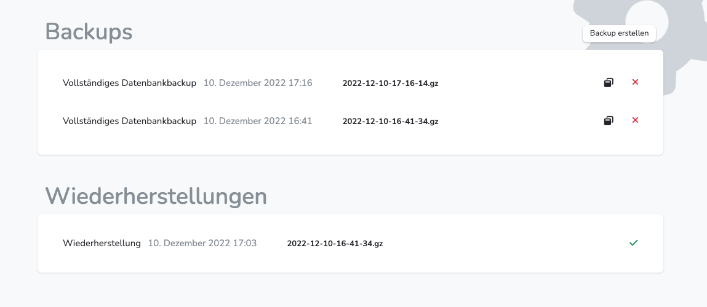
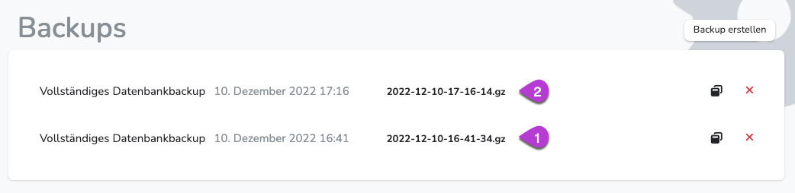
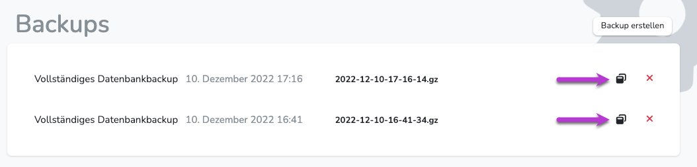

---
hide:
    - footer
---

{ .img-head }

!!! note ""
    Backups sollten regelmäßig und vor Eingriffen in die Stammdatenverwaltung vorgeommen werden. 
    Also etwa vor Importen oder Veränderungen an Klassen, Schülern, Fächern, Unterrichten oder Lehrern. 

!!! success ""
    Grundsätzlich arbeitet Diplomify mit **zwei** verschiedenen Backup-Arten:
    
    1. Das Server-Backup: Dabei wird täglich das gesamte System gesichert. 
    **Eine Wiederherstellung ist nur mit Zugriff auf den Server möglich.** Wenn sie einen solchen Zugriff nicht besitzen, kontaktieren sie bitte ihren Server-Administrator. 
    Sollten Sie Diplomify nicht selbst hosten, schreiben Sie bitte an **[unseren Support](mailto:info@diplomify.de)**.
    2. Das selbst erstellte Backup: Dabei wird ebenfalls das gesamte System gesichert. 
    Die geschieht jedoch **nur**, wenn es direkt ausgelöst wird.

 

### Backup anlegen

**Wechsle dazu in Konfiguration/Backups**

1. Wähle Backup erstellen.
2. Bestätige die Sicherheitsabfrage

Anschließend wird das Backup erstellt. Dies dauert etwa 1 Minute. Ggf. muss die Seute neu geladen werden. 
Ist das Backup erstellt, erscheint es im Bereich "Backups"  
{ .img-head }

 

### Backup wiederherstellen

**Wechsle dazu in Konfiguration/Backups**

{ .img-head }

1. Wähle das gweünschte Backup aus der Liste und drücke den "Restore Button" 
2. Bestätige die Sicherheitsinformation

Das Backup wir nun wiederhergestellt.Das dauert etwa 2 Minuten. Ggf. muss die Seute neu geladen werden.  
Im Anschluss wird es im Bereich "Wiederherstellungen" angezeigt.

!!! danger ""
    Während des Zurücksetzens wird Diplomify temporär nicht für normale Benutzbar verfügbar sein (Wartungsmodus).  
    Sie können diesen Vorgang nicht rückgängig machen und sollten während des Prozesses unter keinen Umständen weitere Änderungen am Datensatz vornehmen.

!!! danger ""
    Werden zwei Backups angelegt und anschließend das zuerst angelegte Backup wiederhergstellt, ist das andere Backup nicht mehr verfügbar. 
    Grund: Es wurde ein Systemstand wiederhergestellt, an dem das andere Backup noch nicht vorhanden war.