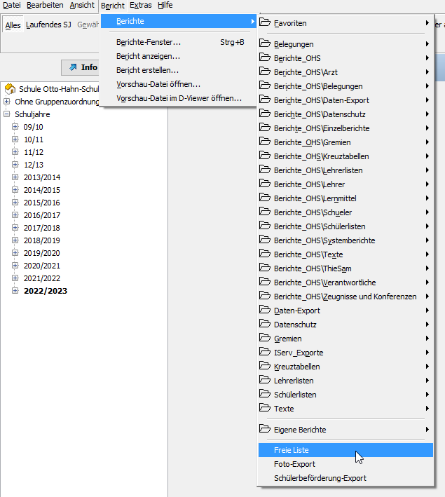
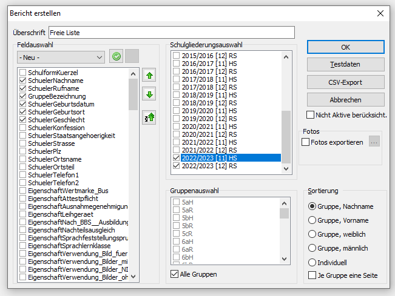

---
hide:
  - footer
---

!!! danger ""
    Die Merkmale müssen sämtlich vorhanden sein und genau so benannt, wie angegeben. 
    Alle Merkmale müssen Daten enthalten.

 
## Exportdatei erstellen
**Die Anleitung bezieht sich auf DaNis in der Version 3**

### 1.: Exportmenü öffnen

Öffne DaNis und wähle im Menü „Berichte“ „Freie Liste“ aus.

{ .image-75 } 

### 2. Exporteinstellungen vornehmen

Markiere im linken Feld folgende Merkmale:  

!!! box ""
    - **SchuelerNachname**
    - **SchuelerRufname**
    - **SchuelerGeburtsdatum** (für das Geburtsdatum auf dem Zeugnis)
    - **SchuelerGeburtsort** (für den Geburtsort auf dem Zeugnis)
    - **SchuelerAufnahmedatum** (wird aus Abgangszeugnissen angegeben)
    - **SchuelerGeschlecht** (für gendergerechte Floskeln)
    - **GruppeBezeichnung** (Klassenangabe auf dem Zeugnis und Zuordnung zur Klasse)
    - **GruppeId** (eindeutige Identifikationsnummer der Klasse bei Mehrfachimporten)
    - **SchuelerId** (eindeutige Identifiktaionsnummer des Schülers bei namensgleichen Schülern)

Wähle anschließend im Bereich „Schulgliederungsauswahl“ das Schuljahr aus, das importiert
werden soll. (In der Regel das aktuelle.)  
Im Bereich „Gruppenauswahl“ wähle „Alle Gruppen“, um die gesamte Schülerschaft und alle Klassen zu exportieren.

{ .image-75 }

### 3. Auswahl für später speichern

Speichere die Merkmalauswahl, damit du beim nächsten Export sofort darauf zugreifen kannst.
Klicke dazu auf das kleine grüne Häkchen im Bereich „Feldauswahl“ und vergib bspw. die Bezeichnung „Diplomify - Schülerexport“.

### 4. CSV-Datei erstellen

Nun kann die Exportdatei erstellt werden:
Klicke dazu rechts auf CSV-Export.
Bei der anschließenden Abfrage kannst du festlegen in welchem Format die Datei erstellt werden soll. **Wähle bitte unbedingt UTF-8.**

Die erstellte Datei kann nun in Diplomify importiert werden.  
[Zum Artikel über den Import...](../Administration/Import.md)