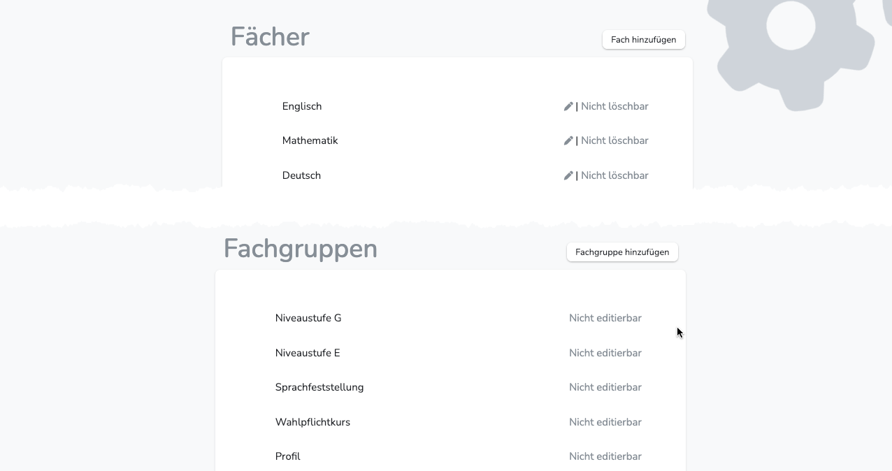
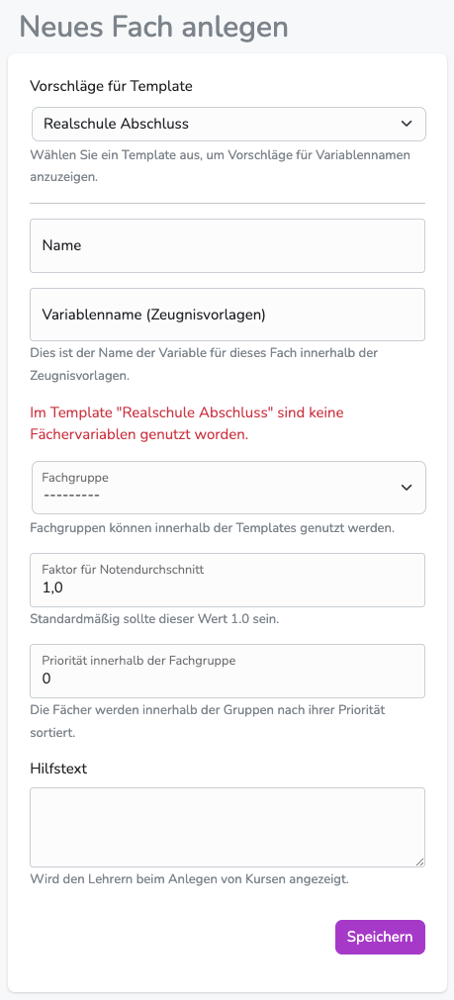

---
hide:
  - footer
---

 
{ .img-head }

## Fächer verwalten

!!! note ""
    Um eine Bewertung zu ermöglichen, müssen einmalig Fächer angelegt werden. 
    Diese Fächer können entweder reguläre Kanonfächer sein, aber auch Wahlpflichtkurse, Profilfächer, Fächer für Sprachfeststellungsprüfungen oder Kompetenzbeschreibungen.   
    Ob es sich um ein Wahlpflichtkurs oder Profilfach handet, wird durch die Fachgruppe festgelegt.   
    Zudem müssen allen regulären Kanonfächern Variablen zugeordnet werden, damit sie auf dem Zeugnis korrekt angeordnet werden können und die korrekte Note ausweisen.

1. Wechsle in den Bereich "Fächer"
2. Wähle "Fach hinzufügen" 
  
{ .img-head }
  
3. Die erste Auswahl "Vorschläge für Template" legt fest, welche Variablen bei "Variablenname (Zeugnisvorlagen)" vorgeschlagen werden. Diplomify durchsucht also die Zeugnisvorlage und sucht alle verfügbaren Variablen heraus.
4. Wenn also bei "Name" der Fächername vergeben wird (wird so auch auf dem Zeugnis angezeigt), kann gleich die entsprechende Variable ausgewählt werden. (Variablen können beliebig benannt werden, müssen aber ihre Entsprechung in der Zeugnisvorlage haben. Bei individuellen Variablen muss daher das Template geändert werden.)
5. Handelt es sich um ein Sonderfach (z.B. WPK, Profil, Fach mit ausgewiesenem Anforderungsniveau, Fach für Sprachfeststellungsprüfung) muss die entsprechende Fachgruppe gewählt werden.
 
Bei Fächern mit abweichendem Anforderungsniveau wird das gewählte Niveau auf dem Zeugnis ausgewiesen. (Erhält ein Schüler eine Note in Mahematik Fachgruppe "Niveaustufe G" erhält Mathematik auf dem Zeugnis einen entsprechenden Vermerk.) Niveaustufen sind derzeit für die Fächer Mathematik und Englisch möglich. 
**Für den Variablennamen bitte folgendes Schema anwenden 'fachgruppenkürzel'_'fach'. (z.B. wpk_erdkunde)**
6. Im letzten Feld **kann** die Priorität des Faches innerhalb der Fachgruppe festgelegt werden. Das betrifft vor allem WPK und Profile. Soll ein Fach auf dem Zeugnis immer auf Platz 1 bei den WPK stehen, kann hier Priorität 1 gewählt werden. Alle anderen WPK erhalten eine höhere Ziffer und sind demnach untergeordnet. (In den meisten Fällen kann hier der Standardwert "0" belassen werden.)
7. Durch "Speichern" wird das Fach angelegt.

!!! danger ""
    Fächer können nicht mehr gelöscht werden, wenn ein beliebiger Schüler darin bewertet wurde.
 

## Fächervariablen

Interessen, Fähigkeiten, Fertigkeiten - interessen

Sprechen und Zuhören - sprechen
Lesen und mit Texten umgehen - lesen
Schreiben, Texte erfassen - schreiben

Zahlen und Operationen - zahlen
Größen und Messen - messen
Raum und Form - raum

## Fachgruppen verwalten

!!! danger ""
    Standardverwendung bitte in Fächer verwalten (Abschnitt 5) nachlesen.

!!! note ""
    Fachgruppen ermöglichen das Kategorisieren und automatische Verarbeiten von Fächern in den Zeugnisvorlagen. 
    Durch die Priorisierung der Fächer in einer Fachgruppe ist es möglich, durch die Fächer zu iterieren und gleichzeitig eine festgelegte Reihenfolge beizubehalten. Dadurch sind sehr effiziente Zeugnistemplates möglich. 

!!! warning ""
    Wenn die Zeugnisvorlagen nicht angepasst werden sollen, können die Standard-Fachgruppen verwendet werden.

1. Wechsle in den Bereich "Fächer"
2. Wähle "Fachgruppe hinzufügen"
3. Fachgruppen können beliebig benannt werden. (Das Kürzel wird innerhalb von Diplomify dem Fach angehangen.)