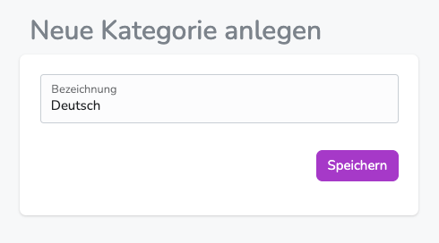
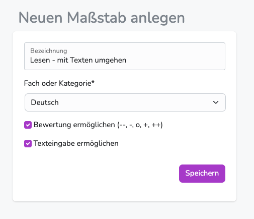
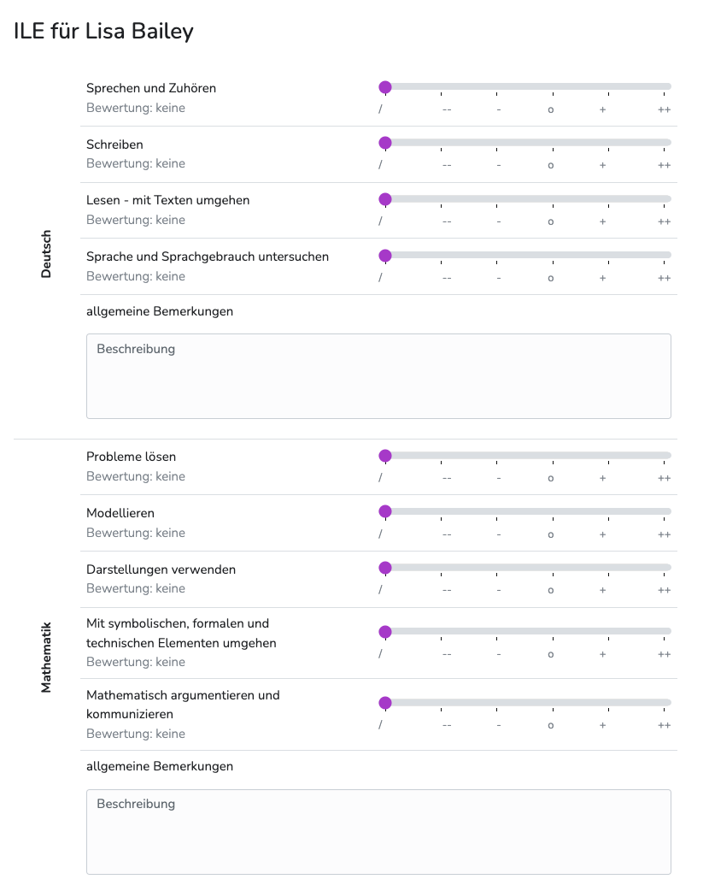
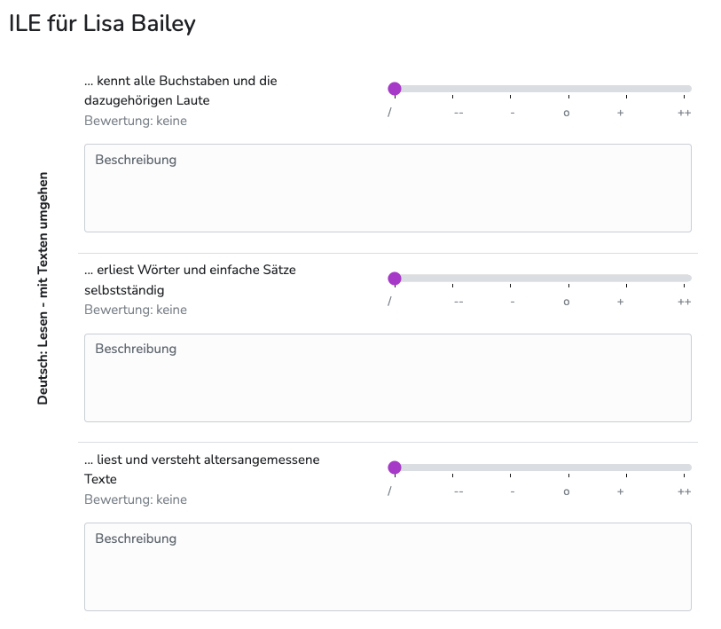

---
hide:
  - footer
---

!!! bread ""
    Adminbereich > Lernentwicklung

Diplomify behandelt ILE-Dokumentationen äußerst flexibel und anpassbar.  
Die folgenden Schilderungen sollen beispielhaft das Anlegen und Strukturieren von Bewertungskriterien zeigen.

 

## Allgemeines

### Bewertungsaspekte
Es können Bewertungsaspekte angelegt und dabei bestimmt werden, ob die Bewertung per Skala (Schieberegler) stattfinden soll oder per Texteingabe.
Beide Bewertungsmethoden sind kombinierbar.

### Fächer/Kategorien
Die angelegten Bewertungsaspekte lassen sich Kategorien/Fächern zuordnen. Auf diese Weise behalten die bewertenden Kolleg/innen den Überblick und die Auswertung kann strukturierter erfolgen.

 

## Kategorien anlegen
Eine neue Kategorie kann über den "hinzufügen"-Button im Bereich Fächer/Kategorien angelegt werden.  
Die vergebene Bezeichnung sollte die Bewertungsaspekte, die im nächsten Schritt zugeordnet werden, aussagekräftig zusammenfassen. Einige Schulen entscheiden sich für die Bezeichnung der Fächer (z.B. Deutsch), in denen eine Bewertung stattfindet. Es können aber auch die Namen von Kompetenzen (z.B. Lesen - mit Texten umgehen) vergeben werden - oder eine Kombination (z.B. Deutsch: Lesen -  mit Texten umgehen)

{ .img-norm }

 

## Bewertungsaspekte anlegen
Durch "hinzufügen" können beliebig viele Bewertungsaspekte angelegt werden.

{ .img-norm }

- **Bezeichnung:** Name des Bewertungsaspektes (Wird den Lehrkräften bei der Bewertung und beim Export des ILE-Bogens angezeigt)
- **Fach oder Kategorie:** Hier kann der Bewertungsaspekt einer Kategorie zugeordnet werden. (Sollten keine Kategorien angezeigt werden, bitte erst welche anlegen. (siehe "Kategorien anlegen"))
- **Bewertungsart:** Einzeln oder beide Varianten gleichzeitig möglich.

Der Vorgang kann beliebig oft wiederholt werden - bis alle benötigten Bewertungsaspekte und Kategorien angelegt wurden.
 

**mögliche Ergebnisse:** 
Die angelegten Kriterien können direkt nach dem Anlegen von den Lehräften zur Bewertung genutzt werden.

!!! bread ""
    Klassenübersicht > Av/Sv | Bemerkungen | ILE > ILE Dokumentation 
    

{ .img-norm }
{ .img-norm }