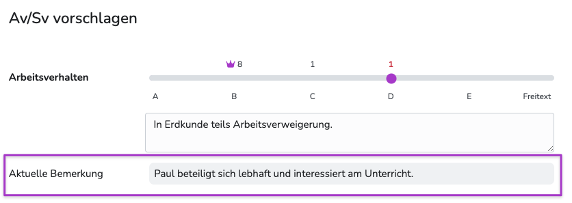
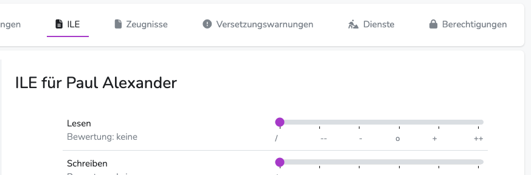

---
hide:
  - footer
---

!!! bread ""
    Administrationsbereich | Konfiguration | Rechte

{ .img-head }

## Nutzerarten

Es gibt in Diplomify ein rollenbasiertes Berechtigungssystem. [Standardeinstellungen](#standardeinstellungen)

|Nutzertyp | Standardrechte | Rollenstatus |
| -------- |----------------| -------------|
|**Nutzer** (Fachlehrkräfte)| Unterricht anlegen,   Schüler/innen zuordnen,  Bewertungen im eigenen Unterricht sehen,  im eigenen Unterricht bewerten | Rechte können entzogen werden,  können zu Klassenleitungen,  Klassenadmins,  ILE-Admins,  Systemadmins aufsteigen |
| **Klassenleitung** (Klassenlehrkraft)| **wie normale Nutzer**,  wird auf dem Zeugnis als Klassenleitung angezeigt (sofern auf dem Template entsprechend konfiguriert),  kann Klassenadmins und ILE-Admins festlegen  | automatisch **Klassenadmin** und **ILE-Admin** (Rechte können entzogen werden),  Rolle immer bezogen auf jeweilige Klasse(n),   Rolle **Nutzer** für alle SuS außerhalb der eigenen Klasse
| **Klassenadmin**  | gleiche Rechte wie Klassenleitung,   **zusätzlich** volle Schreib- und Leserechte bei allen Schüler/innen der entsprechenden Klasse(n) | Rolle immer bezogen auf jeweilige Klasse(n)
| **ILE-Admin**     | Zugriff auf ILE-Bereich in Klassenübersicht der jeweiligen Klasse(n),   Schreibrechte für ILE-Bemerkungen | Rolle immer bezogen auf jeweilige Klasse(n),   Rolle kann an Nutzer ohne Klassenleitung- oder Klassenadminstatus vergeben werden.
| **Systemadmin**   | **kann immer alles**   volle Lese- und Schreibrechte in allen Klassen und Unterrichten,  Zugriff auf Adminbereich,   und auf (kritische!) Systemeinstellungen

Die Standardrolle ist in jedem neuen Halbjahr **Nutzer**. In jedem Halbjahr muss daher erneut festgelegt werden, wer in einer Klasse die Klassenleitung ist und damit die entsprechenden Rechte des Klassenadmins und ILE-Admins bekommt.  
Zusätzlich können weitere Nutzer zu Klassenadmins oder ILE-Admins befördert werden.

**Systemadministratoren** behalten ihre Rolle, bis sie der betreffenden Lehrkraft in den Stammdateneinstellungen entzogen wird.

 

## Neuen Unterricht anlegen
Ist dieses Recht für jede Lehrkraft erteilt, können diese in "Mein Unterricht" eigenen Unterricht anlegen, dort Schüler/innen zuordnen und anschließend bewerten.

Dieses Recht muss auch erteilt werden, wenn der Unterricht per Integration (z.B. per WebUntis) angelegt wurde.

Als Alternative kann das Anlegen der Unterrichte auch vom Admin erledigt werden. Diese Aufgabe kann allerdings mit hohem Arbeitsaufwand verbunden sein. (ausser bei Import aus z.B. WebUntis)

 

## Noten sehen
Lege hier fest, wer Lesezugriff auf sämtliche Bewertungen aller Schüler/innen hat.  

Grundsätzlich ist aus DSGVO-Perspektive empfehlenswert, nur die Klassenadmins und natürlich die unterrichtenden Lehrkräfte mit diesem Recht auszustatten.  

Auf diese Weise kann die Klassenleitung alle Noten ihrer Schüler/innen sehen und die entsprechende Fachlehrkraft sieht die Noten der SuS in den von ihr gegebenen Unterrichten.
Steht das Recht auf "jeder" kann jede Lehrkraft alle Bewertungen jedes Kindes in allen Fächern sehen.

 

## Noten vergeben
Hier kannst du entscheiden, ob Lehrkräfte nur die eigenen Bewertungen editieren dürfen oder ob sie grundsätzlich Schreibzugriff auf alle Bewertungen haben.  

!!! danger ""
    Dieses Recht überlagert "Noten sehen". Wenn jeder Noten vergeben darf, kann auch jeder alle Noten/Bewertungen sehen. 

Im Falle einer Einschränkung können nur die eigenen Bewertungen in der Notenübersicht, Schüleransicht und Einzelfachansicht geändert werden.   

Die Klassenadmins/Klassenleitungen haben grundsätzlich immer Schreibrechte.

**Achtung:** Sind zwei Kolleg/innen demselben Unterricht zugeordnet (etwa im Falle einer Doppelsteckung) können beide die Bewertungen des jeweils anderen ändern.

 

## Arbeits- und Sozialverhalten in Einzelfachansicht sehen
Die Klassenleitung macht Vorschläge für Av/Sv, die von den Fachkolleg/innen in der Einzelfachansicht eingesehen werden können. 
In der Einzelfachansicht wird grundsätzlich immer die Skala mit der gewählten Abstufung (A-Freitext) zur Abstimmung angezeigt.  
Hier kann festgelegt werden, ob auch die Texteinträge der Klassenleitung angezeigt werden sollen. 

{ .image }

 

## ILE Bemerkungen bearbeiten
Da auch die ILE-Bemerkungen - wie die übrigen Bewertungen - nicht zwangsläufig jeder Fachlehrkraft der Klasse zugänglich sein müssen, kann hier festgelegt werden, wer die entsprechende Berechtigung erhält.  
Steht das Recht auf "Nur durch ILE-Administratoren" müssen die entsprechenden Rollen in der Klassenübersicht von der Klassenleitung oder einem Klassenadmin (oder Systemadmin) vergeben werden.  
Alle Nutzer, denen diese Rolle zugewiesen wurde, haben anschließend in der entsprechenden Klasse Lese- und Schreibrechte im ILE-Bereich.

{ .image }

 

## Lehrer zu Unterricht hinzufügen
Manchmal kann es nötig sein, weitere Lehrkräfte zu einem vorhandenen Unterricht hinzuzufügen. Standardmäßig kann das nur der Administrator, weil durch das Hinzufügen automatisch Schreibrechte in dem entsprechenden Unterricht vergeben werden.  

Es gibt aber die Möglichkeit, das Hinzufügen auch durch Klassenlehrkräfte und Fachlehrkräfte (die bereits durch Erstellung dem Unterricht zugewiesen sind) zu erlauben.

Grundsätzlich kann das Recht auch auf alle Kolleg/innen erweitert werden. Dann können sich alle Lehrkräfte nach Belieben Unterrichten zuordnen und haben darin volle Schreibrechte.

 

## Klassenleitung zuweisen
Als Klassenleitung erhält die entsprechende Lehrkraft standardmäßig die Rollen **Klassenadmin** und **ILE-Admin** und damit volle Schreib- und Leserechte bei allen Eintragungen der Kinder ihrer Klasse. Zusätzlich kann sie Konferenzen durchführen und - sofern die Berechtigung entsprechend vergeben wurde - auch Lehrkräfte bestimmten Unterrichten zuordnen.  

Das sind umfangreiche Rechte, die nicht leichtfertig vergeben werden sollten.
Wir empfehlen daher, die Einstufung als Klassenlehrkraft entweder vorab durch den System-Administrator oder mittels Bestätigung durch den System-Administrator vorzunehmen.  

Bei der Bestätigung durch den Administrator kann jede Lehrkraft über den Button in der Checkliste Anspruch auf die Klassenleitung erheben und der Administrator muss diese Anfrage dann nur noch bestätigen.

 

## Zeugniskonferenzen sehen
Standardmäßig kann die Einstellung auf "Jeder Fachlehrer" bleiben. 
Auf diese Weise können Klassenleitungen (und Klassenadmins) und jene Fachlehrkräfte, die in der Klasse Noten vergeben haben, an der Zeugniskonferenz teilnehmen. 

Die Teilnahme erfolgt für Fachlehrkräfte im Zuschauermodus entweder über einen QR-Code beim Konferenzstart oder dem "An der Konferenz teilnehmen" - Button in der entsprechenden Klassenübersicht. 

Soll ein Zugriff auf den Zuschauermodus für die Fachlehrkräfte ausgeschlossen werden, kann das Recht auf "Nur Klassen-Administratoren" gesetzt werden.

!!! danger ""
    Sollte einer Klassenleitung die Rolle "*Klassenadmin*" entzogen worden sein, kann sie die Konferenz nicht starten.

 

## Zeugnisse bearbeiten
Dieses Recht umfasst alle Änderungen, die in der Klassenübersicht vorgenommen werden können - **bis auf die ILE-Bemerkungen**.

Sollte jede Lehrkraft dieses Recht bekommen, können sie alle Zeugnisdaten aber auch das Arbeits- und Sozialverhalten oder die Fehltage bearbeiten.
Standardmäßig sollte dieses Recht daher den Klassenadmins vorbehalten sein, da die Änderungsmöglichkeiten sehr umfangreich sind und die Klassenübersicht aus DSGVO-Perspektive für Fachlehrkräfte irrelevant ist.

Bei Bedarf können durch Klassen- oder System-Admins weitere Nutzer zu Klassenadmins befördert werden, um einzelnen Lehrkräften doch Eintragungen zu ermöglichen.

 

## Gesperrte Halbjahre
Sobald ein Halbjahr gesperrt wurde, kann (bis auf System-Adminstratoren) niemand mehr Änderungen an den eingetragenen Daten vornehmen.
Um zumindest einen informierenden Blick zu ermöglichen, kann das Recht hier auf "Lesezugriff" gesetzt werden.
Bei "Kein Zugriff" wird ein Info-Screen angezeigt, sobald jemand in ein geschlossenes Halbjahr wechselt.

 

## Zugriff außerhalb der Eingabezeiträume
Ist ein Halbjahr mit einem Start- und/oder Enddatum für die Eingabe versehen, wird jeder Login ausserhalb dieser Zeit auf eine Info-Seite umgeleitet. 

Die Eingabezeiträume können aber genutzt werden, um eine gestaffelte Eingabe zu ermöglichen.  
So können mit der entsprechenden Rechtevergabe Klassenleitungen & Klassenadmins bereits vor dem Eingabestart Zugriff erhalten und ihre Klassen vorbereiten. Sobald dann der Eingabezeitraum gekommen ist, können alle Fachlehrer ebenfalls mit ihren Eingaben beginnen.

 

## Standardeinstellungen 

| Bezeichnung                                             | Standardwert                                |
| ------------------------------------------------------- |---------------------------------------------|
| Neuen Unterricht anlegen                                | Jeder                                       |
| Noten sehen                                             | Nur unterrichtende Lehrer und Klassenadmin  |
| Noten vergeben                                          | Nur unterrichtende Lehrer und Klassenadmin  |
| Arbeits- und Sozialverhalten in Einzelfachansicht sehen | Jeder der die Einzelfachansicht nutzen kann |
| ILE Bemerkungen bearbeiten                              | Nur durch ILE Administratoren               |
| Lehrer zu Unterricht hinzufügen                         | Durch Klassenadmins und Kurslehrer          |
| Klassenlehrer zuweisen                                  | Bestätigung durch Administrator             | 
| Zeugniskonferenzen sehen                                | Jeder Fachlehrer                            |
| Zeugnisse bearbeiten                                    | Nur durch Klassen Administratoren           |
| Gesperrte Halbjahre                                     | Nur Lesezugriff                             |
| Zugriff außerhalb der Eingabezeiträume                  | Nur durch Klassen Administratoren           |
