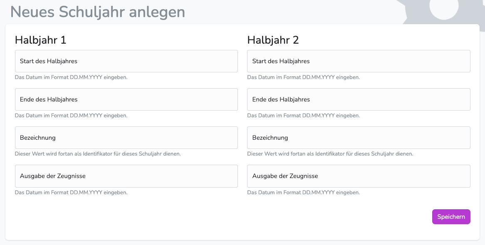

---
hide:
  - footer
---
{ .img-head }

!!! note ""
    Spätestens zu Beginn der Zeugnisphase im ersten Schulhalbjahr muss ein neues Schuljahr angelegt werden.  

    **Zu jedem Schuljahr gehören folgende Daten:**  
    - Startdatum der Halbjahre  
    - Enddatum der Halbjahre 
    - Bezeichnung der Schulhalbjahre 
    - Ausgabedatum der Zeugnisse 

### Schuljahr anlegen

1. Wechsle in den Bereich "Schuljahre"
2. Wähle "Schuljahr anlegen"
3. Trage die geforderten Daten ein.

Es müssen immer direkt beide Halbjahre angelegt werden.  

!!! intralink ""
    Nach dem Anlegen der Schuljahre können die aktuellen Schüler*innen und Klassen importiert werden: [**Schüler*innen verwalten**](../Administration/student_administration.md)   
    Außerdem können die Halbjahrestermine (Zeugnisausgabedaten und Konferenzdaten) hinterlegt werden: [**Schuljahresdaten angeben**](../Administration/Termine_anlegen.md)