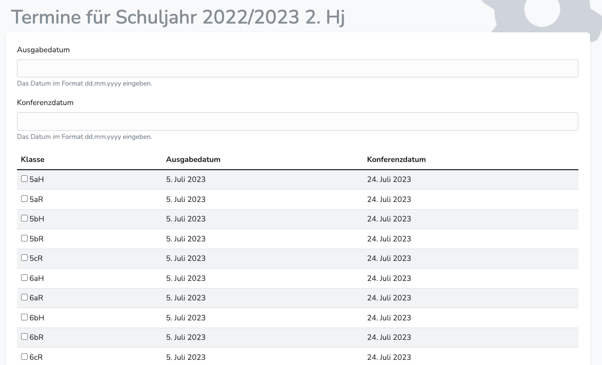
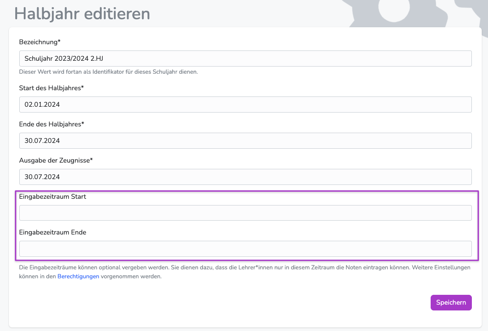

---
hide:
  - footer
---

!!! bread ""
    Administrationsbereich > Schuljahre

{ .img-head }

## Schuljahr anlegen

1. Wechsle in den Bereich "Schuljahre"
2. Wähle "Schuljahr anlegen"
3. Trage die geforderten Daten ein.
    - Startdatum der Halbjahre  
    - Enddatum der Halbjahre 
    - Bezeichnung der Schulhalbjahre 
    - Ausgabedatum der Zeugnisse 

Es müssen immer direkt beide Halbjahre angelegt werden.  

Nach dem Anlegen der Schuljahre können die aktuellen Schüler*innen und Klassen importiert werden<!-- : [**Schüler*innen verwalten**](../Administration/student_administration.md) -->  
Außerdem können die Halbjahrestermine (Zeugnisausgabedaten und Konferenzdaten) hinterlegt werden.

 

## Ausgabedaten und Konferenzdaten angeben

!!! danger ""
    Termine können nur angegeben werden, wenn zuvor Klassen importiert wurden.

{ .img-head }

Sowohl das Ausgabedatum, als auch das Konferenzdatum werden auf den Zeugnissen vermerkt und müssen angegeben werden.  

**Ist bei einer Klasse kein Konferenztermin gesetzt, fügt Diplomify automatisch den Tag ein, an dem die Zeugniskonferenz dieser Klasse zum ersten Mal in der Klassenübersicht gestartet wird. **

Grundsätzlich können die Termine von den Klassenlehrkräften für ihre Schüler*innen individuell angepasst werden - die Voreinstellungen sollten trotzdem zentral vorgenommen werden.

**Achtung:** Ohne vorherige Angabe der Termine durch den Administrator kann keine individuelle Anpassung durch Lehrkräfte erfolgen. 

### Termine anlegen

!!! bread ""
    Schuljahre > Halbjahr bearbeiten > Sidebar/Allgemeines: Termine anlegen

1. Trage die entsprechenden Termine in die dafür vorgesehenen Felder.
2. Wähle jene Klassen aus, denen die Termine zugeordnet werden sollen.
3. Speichern.  
4. (Wiederhole den Vorgang, bis alle Klassen einen Zeugnisausgabetermin und einen Konferenztermin haben.)

!!! note ""
    Die Variablen in den Floskeln wie {conferenceDate} werden erst automatisch ersetzt, wenn die Zeugnisdaten zuvor angelegt wurden.  
    Bereits "eingefügte" Floskeln müssen dann ersetzt werden.

 

## Eingabezeiträume angeben

!!! bread ""
    Schuljahre > Halbjahr bearbeiten > Sidebar > Edit-Modus (Stift unten links in der Sidebar)

{ .image }

Die Eingabezeiträume sind optional.  
Ist ein Eingabezeitraum festgelegt, haben nur Systemadministratoren Zugriff auf Diplomify. Allen anderen Nutzern wird ein Info-Screen angezeigt.
[Im Rechtemanagement kann festgelegt werden, ob Klassenadmins auch Zugriff ausserhalb des Eingabezeitraumes erhalten sollen.](../../Anleitungen/Administration/Rechte_vergeben.md#zugriff-auerhalb-der-eingabezeitraume)
Die Eingabezeiträume gelten jeweils immer nur für das gewählte Halbjahr.

 

## Halbjahr sperren

!!! bread ""
    Schuljahre > Halbjahr bearbeiten > Sidebar > Schuljahr sperren

Um die Bearbeitung eines Halbjahres komplett zu verhindern (ausser für Systemadmins) kann es vollständig gesperrt werden. 
Das hat zur Folge, dass [(je nach vergebenen Rechten)](../../Anleitungen/Administration/Rechte_vergeben.md#zugriff-auerhalb-der-eingabezeitraume) entweder ein Info-Screen angezeigt wird (Recht: Kein Zugriff) oder nur Leserechte bestehen (Recht: Nur Lesezugriff)

 

## Schuljahr löschen

!!! bread ""
    Schuljahre > Halbjahr bearbeiten > Sidebar > Beide Halbjahre löschen

!!! danger ""
    Beim Löschen eines Schuljahres wird der gesamte Datensatz entfernt. Alle Eintragungen gehen verloren.

Prinzipiell ist das Löschen nur in sehr wenigen Ausnahmefällen sinnvoll. Falsch eingetragene Daten können auch im Nachhinein noch verändert werden. Siehe weiter oben auf deiser Seite. Sollte es trotzdem nötig sein, empfehlen wir dringend zuvor ein Backup anzulegen.

Schuljahre ohne Schüler/innen können (bedenkenloser) gelöscht werden, weil darin weder SuS importiert wurden, noch Bewertungen vergeben werden konnten.

