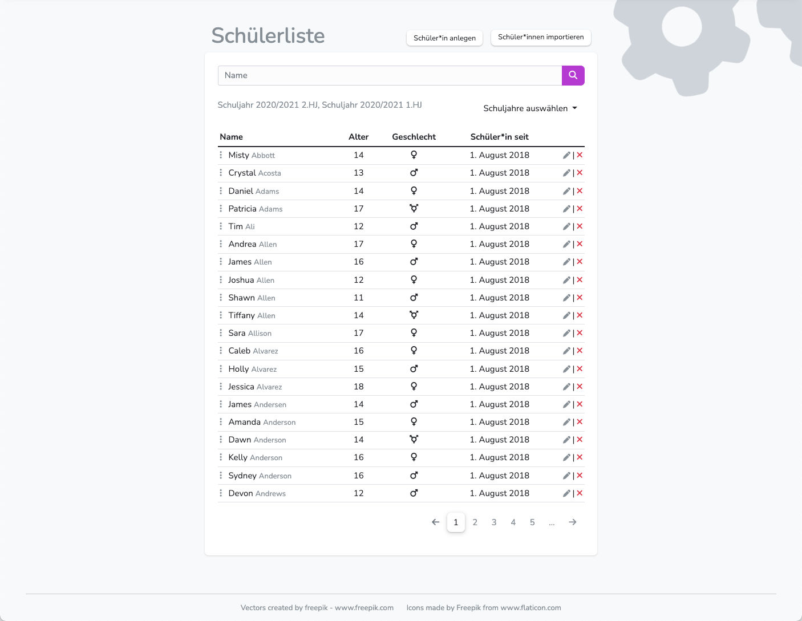
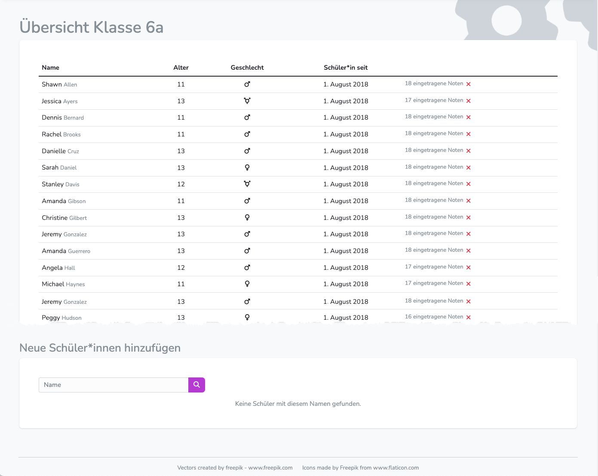
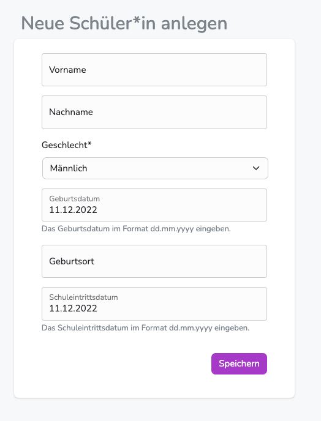
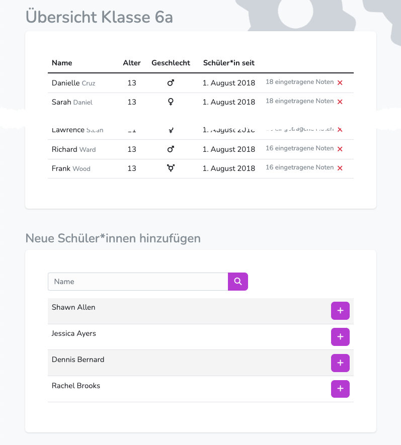
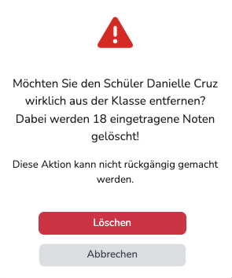

---
hide:
    - footer
---

    <figure>
        <figcaption class="img-caption">Schüler*innen verwalten</figcaption>
        
    </figure>

    <figure>
        <figcaption class="img-caption">Klassen verwalten</figcaption>
        
    </figure>

## Schüler verwalten

!!! note ""
    Die Schülerverwaltung ermöglicht das Hinzufügen **per Hand**, **per Import** und das **Löschen** von Schüler*innen.
 

### Schüler*innen per Hand hinzufügen

!!! danger ""
    Wir empfehlen ausdrücklich das Anlegen von Schüler*innen durch den Import per csv-Datei oder Sysnchronisierung mit einem verbundenen Integrationspartner wie WebUntis.

{ .img-norm } 

**Wechsle dazu in Personendaten/Schüler**

1. Wähle Schüler*in anlegen.
2. Trage die geforderten Daten ein.
3. Beende die Eingabe mit { .img-inline }

Die vorhandenen Felder sind Pflichtfelder und müssen gewissenhaft ausgefüllt werden.

!!! Warning ""
    Da die derartig angelegten Schüler*innen über keine Schüler-ID verfügen, kann für sie keine automatische Zuordnung zu Klassen und Kursen stattfinden.

!!! intralink ""
    Im nächsten Schritt **müssen** derartig angelegte Schüler*innen ihrer Klasse zugeordnet werden [**Schüler*in zu Klassen hinzufügen**](#schulerinnen-zur-klasse-hinzufugen)

---
### Schüler*innen per csv-Datei oder Integration importieren
<!-- !!! intralink "" -->
Weitere Informationen erhalten Sie im Bereich [**Import**](../../Anleitungen/Administration/Import.md)

---

### Schüler*innen löschen

!!! note ""
    Das Löschen von Schüler/innen wirkt sich auf deren gesamte Bewertungen in allen angelegten Schuljahren aus. Alle Eingaben werden vollständig aus der Datenbank entfernt. 
     
    Sinnvoller ist es, die [Schüler*innen aus ihrer Klasse zu entfernen](#klassen-verwalten). So verbelieben sie im System, werden aber nirgendwo mehr angezeigt, bis eine erneute Klassenzuordnung erfolgt.

**Wechsle dazu in Personendaten/Schüler**

1. Wähle den oder die gewünschte Schüler*in aus. (ggf. per "Suche")
2. Klicke auf das 
3. Bestätige die Sicherheitsabfrage.  
{ .img-norm }

!!! danger ""
    Wenn Schüler*innen gelöscht werden, werden auch sämtliche Zeugnisdaten dieser Person aus allen Schuljahren entfernt.  
    Die Löschung kann nicht rückgängig gemacht werden.  
    (Es sei denn, es wurde ein [**Backup**](../../Anleitungen/Adminstration/Backup.md) angelegt.)

 
## Klassen verwalten

!!! note ""
    In der Klassenverwaltung können die dazugehörigen SuS hinzugefügt und entfernt werden.  

Diplomify behandelt in jedem Schulhalbjahr alle Klassen eigenständig. Sie können daher zwar den gleichen Namen tragen und die selben Schüler*innen beinhalten, müssen aber in jedem Halbjahr separat verwaltet werden. - Das bedeutet für die Administration, dass sich alle Maßnahmen in der Klassenverwaltung nur auf die Klassenzusammensetzung in dem aktuell gewählten Halbjahr auswirken. 

**Wechsle dazu in Übersicht**

1. Wähle das Halbjahr aus, in den eine Klasse bearbeitet werden soll
2. Wähle eine der angezeigten Klassen aus und klicke darauf.   
{ .img-norm }

 

### Schüler*innen aus der Klasse entfernen

!!! danger ""
    Bei der Löschung werden auch alle in diesem Halbjahr eingetragenen Noten entfernt. 
    Derartige Maßnahmen finden daher am besten vor der Noteneintragung statt.

!!! success ""
    Man kann dieses Verfahren auch nutzen, um alle Einträge zu dem Kind zurückzusetzen.  
    Dazu entfernt man es aus der Klasse - Noten werden gelöscht.   
    Anschließend fügt man es wieder hinzu - alle Notenfelder, Av/Sv, Bemerkungen und ILE-Eintragungen entfernt.

1. Suche in der Tabelle das gewünschte Klassenmitglied
2. Klicke auf das 
3. Bestätige die Sicherheitsabfrage  
{ .img-norm }

!!! danger ""
    Sobald der oder die letzte Schüler*in aus der Klasse entfernt wurde, wird die Klasse unwiederbringlich gelöscht.
     
    Lege vor der Arbeit an den Klassen ein [**Backup**](../../Anleitungen/Adminstration/Backup.md) an.

 

### Schüler*innen zur Klasse hinzufügen

{ .img-norm }

!!! note ""
    Per Hand erstellte Schüler*innen, fehlerhaft importierte SuS oder akute Klassenwechsler können per Hand einer Klasse zugeordnet werden.  

**Wechsle dazu in Übersicht**

1. Wähle das Halbjahr aus, in den eine Klasse bearbeitet werden soll
2. Wähle eine der angezeigten Klassen aus und klicke darauf.
3. Unten auf der Seiten werden die "freien" SuS angezeigt.
4. Nutze ggf. die Suche, um die gewünschte Person zu finden.
5. Füge sie mit { .img-small-inline } der Klasse hinzu.

!!! warning ""
    Bitte bedenke, dass SuS die per Hand erstellt wurden, zwar der Klasse und dem Klassenunterricht zugeordnet ist, nicht aber den Kursen.  
