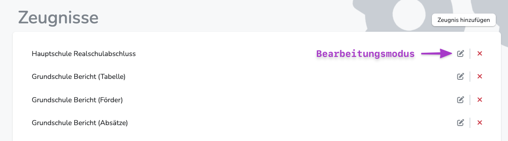
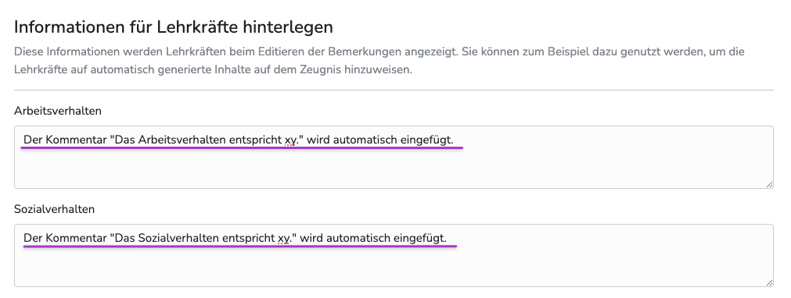
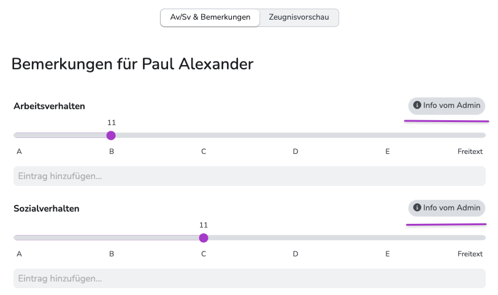
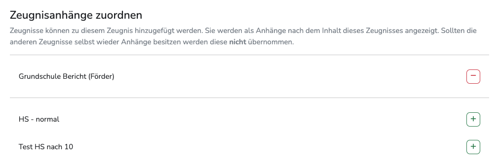
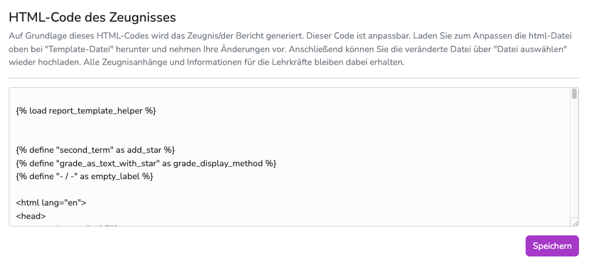

---
hide:
  - footer
---
!!! bread ""
    Adminbereich > Zeugnisse > gewünschtes Zeugnis > Bearbeitungsmodus
{ .img-head }

## 1. Zeugnistemplates herunter-/hochladen

!!! note ""
    **Warum muss ich das überhaupt wissen?** 
    Die Zeugnisse basieren in Diplomify auf einfachen HTML-Dateien (Wir nennen das "Template").  
    Auf diese Weise sind sie ausserordentlich flexibel und können in jedem beliebigen Editor bearbeitet werden.  
    Anschließend können die editierten Dateien hier wieder hochgeladen und verwendet werden.

1. **zum Herunterladen**: klicke auf den Dateinamen des derzeit verwendeten Templates
2. **nach der Bearbeitung**: ziehe die hochzuladende Datei auf den Bereich wo "Keine ausgewählt" steht oder klicke auf "Datei auswählen", um die entsprechende Datei auf deinem Computer zu suchen.
3. Speichern drücken
3. **Zurücksetzen**: Achtung, hier wird der vorhandene Inhalt des Templates restlos entfernt. Diese Aktion ist nur durch Einspielen eines Backups umkehrbar.

 
 

## 2. Informationen für Lehrkräfte hinterlegen
{ .img-head }

!!! note ""
    **Warum muss ich das überhaupt wissen?** 
    Da die Zeugnistemplates hochgradig flexibel sind, können Administratoren Funktionen integrieren, die zum Beispiel zu automatischen Einträgen auf dem Zeugnis führen.
    Um das Kollegium über jene Funktionen zu informieren, können Admins hier Infos anlegen, die an den entsprechenden Feldern angezeigt werden.  
    Diese Infos beziehen sich immer nur auf das Zeugnis, das gerade bearbeitet wird.  
    **Ordnet eine Lehrkraft dieses Zeugnis einem Schüler zu**, erhält sie an den entsprechenden Feldern einen Info-Indikator und kann nach dem Draufklicken die Nachricht lesen.

{ .img-head }

 
 

## 3. Zeugnisse kombinieren

{ .img-head } 

!!! note ""
    **Warum muss ich das überhaupt wissen?** 
    Im Prinzip können hier Zeugnisse dauerhaft miteinander verbunden werden.  

    **Beispiel:**  
    Ich möchte Sprachlernern eine Version des normalen Versetzungszeugnisses ausgeben, an das immer automatisch ein Berichtszeugnis angehangen wird.
    Dann erstelle ich erst ein zweites Versetzungszeugnis und ordne diesem dann das entsprechende Berichtszeugnis zu.   
    Anschließend hinterlege ich dieses Kombizeugnis in der passenden Zeugnisgruppe und sorge so dafür, dass es von allen Lehrkräften bestimmten Schüler/innen zugewiesen werden kann. 

1. Wähle dazu im Bereich "Zeugnisanhänge zuordnen" jene Zeugnisse/Berichte aus, die hinzugefügt werden sollen.
2. Anschließend kann mittels der kleinen Pfeile die Reihenfolge festgelegt werden. Grundsätzlich wird das Hauptzeugnis (in dessen Bearbeitungsmodus du dich gerade befindest) immer an erster Stelle gedruckt.

 
 

## 4. Schnell-Änderungen am Template
!!! danger ""
    - Änderungen können nur per Hand rückgängig gemacht werden.  
    - Die Änderungen wirken sich sofort auf alle Zeugnisse aus, die mit diesem Template erstellt werden. - Auch in vergangenen Halbjahren. 
    - Wir empfehlen Änderungen hier nur mit ausreichenden HTML- und CSS-Kenntnissen. 

{ .img-head }

!!! note ""
    **Warum muss ich das überhaupt wissen?** 
    Wenn im laufenden Betreib Fehler auf dem Zeugnis bemerkt werden, muss nicht extra ein neues Templates angelegt werden.
    Rechtschreibkorrekturen oder andere kleinere Änderungen können direkt online vorgenommen werden und sind nach dem Speichern sofort aktiv.
