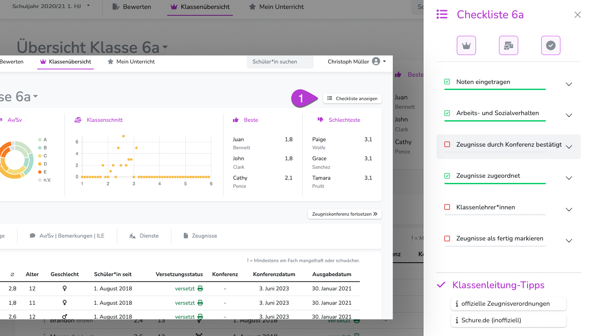

---
hide:
  - footer
---

{ .img-head }

Die Checkliste gibt Klassenlehrkräften eine Reihe von Informationen und Einstellungsmöglichkeiten.

## 1. Informationen in der Checkliste

!!! note ""
    Der Arbeitsfortschritt wird in der Checkliste in Form des grünen Balkens angezeigt. Ist bislang kein Fortschritt erfolgt, ist der Balken grau.  
    Bei kompletter Grünfärbung ist die Arbeit an der speziellen Aufgabe abgeschlossen.

### 1.1 Noten eingetragen

Hier werden alle Fächer dargestellt, die in der Klasse unterrichtet werden - und die dazugehörigen Lehrkräfte.  
An den Zahlen kann abgelesen werden, wie viele Noten vergeben wurden und wie viele Kinder zu diesem Unterricht gehören.  
Ein Klick auf den Fächernamen führt zur Einzelfachbewertung.

### 1.2 Zeugnisse: Versetzungsstatus

Zeugnisse vermitteln auch immer den Versetzungsstatus des dazugehörigen Kindes. Dieser muss daher bei jedem Zeugnis angegeben werden.  
Das kann während der Konferenz geschehen, aber sinvoller ist es, diesen Status bereits in der Vorbereitung anzugeben. Standardmäßg steht der Status auf "versetzt".

### 1.3 Zeugnisse durch Konferenz bestätigt

Sobald in der Zeugniskonferenz alle Zeugnisse begutachtet wurden, erfolgt hier die "erledigt"-Anzeige

### 1.4 Zeugnisse zugeordnet
Prinzipiell kann jedes Kind ein speziell angepasstes Zeugnis bekommen. Daher müssen in jedem Halbjahr die vom Admin bereitgestellten Zeugnisse den Kindern zugeordnet werden.  
Erst wenn alle Kinder Zeugnisse zugeordnet bekommen haben, füllt sich der grüne Balken.  

[Zu Artikel "Zeugnisse zuordnen"](../Schritt_f%C3%BCr_Schritt/Zeugnisse_zuordnen.md){ .md-button }

### 1.5 Klassenlehrer*innen

Hier werden die Lehrkräfte angezeigt, die als Klassenlehrkraft markiert sind.

### 1.6 Zeugnisse als "fertig" markieren

Sobald alle Zeugnisse durch die Konferenz beschlossen wurden, können sie [zum Druck freigegeben werden](#zeugnisse-druckbereit-melden). Ist das geschehen, wird hier "erledigt" angezeigt. 

## 2. Einstellungen in der Checkliste
  
### Sich selbst als Klassenlehrkraft markieren
Klickt man auf die Krone, wird man als Klassenlehrkraft markiert.  
Eine Klasse kann beliebig viele Klassenlehrkräfte haben. - Allerdings sollte immer nur eine Hauptlehrkraft angegeben werden. Denn der Name der Klassenlehrkraft wird auf dem Zeugnis angezeigt (Sofern das Zeugnis vom Admin entsprechend eingerichtet wurde.) Sind mehrere Klassenlehrkräfte markiert, können Layoutprobleme auf dem Zeugnis entstehen.

Jede Lehrkraft kann nur sich selbst markieren/entmarkieren.

### Kolleg*innen an die Noteneingabe erinnern

Ein Klick auf die Krone löst eine Sammelmail aus, die an alle Lehrkräfte der Klasse geschickt wird. Darin erhalten sie eine Erinnerung, dass noch einige Noten fehlen. 

### Zeugnisse druckbereit melden

Wird der Haken aktiviert, erhält der Administrator die Information, dass in dieser Klasse alle Zeugnisse druckbereit sind. Dieser Haken kann nur aktiviert werden, wenn alle Klassenkonferenzen abgeschlossen sind.
