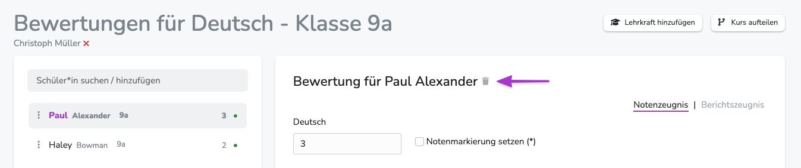
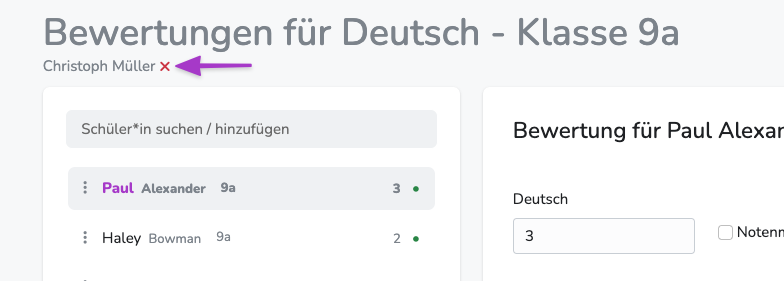
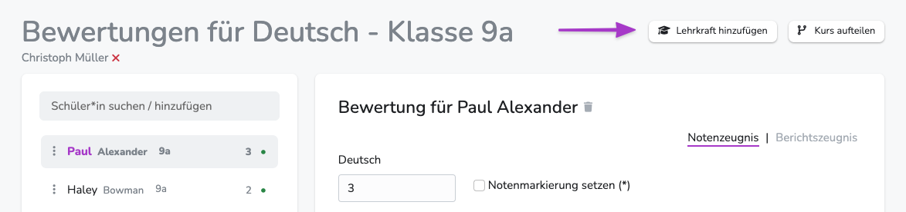
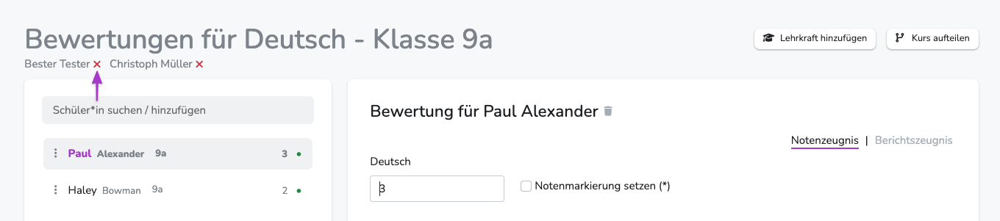

---
hide:
    - footer
---

{ .img-head }

 

!!! note ""
    ## Warum bist du hier?
    - [Ich habe das falsche Fach zugeordnet.](#fach-wechseln)
    - [Zu wenig oder zu viele SuS in meinem Unterricht.](#schulerinnen-entfernen)
    - [Ich unterrichte mit einer anderen Lehrkraft und will sie hinzufügen.](#lehrkrafte-hinzufugen)
    - [Ich will den Unterricht löschen.](#unterricht-loschen)
    - [Ich will den Unterricht verlassen.](#aus-dem-unterricht-austreten)

 

## Fach wechseln
Aktuell ist es nicht möglich das zugewiesene Fach zu wechseln.  
Ich diesem Fall muss der Unterricht komplett neu angelegt werden.  
**Zuvor muss der fehlerhafte Unterricht gelöscht werden.**
Beim Löschen werden sämtliche Bewertungen und Schülerzuordnungen entfernt. 

 

## Unterricht löschen
{ .image-75 }

Unterricht zu löschen ist für Lehrkräfte nur möglich, wenn alle SuS einzeln aus dem Kurs entfernt werden. Mit dem letzten Schüler wird der Unterricht automatisch gelöscht. 
Im Notfall kann der Admin den Unterricht komplett löschen.

!!! danger ""
    Jeweils vergebene Bewertungen werden beim Löschen des Unterrichts durch den Admin oder beim Entfernen eines einzelnen Kindes aus dem Unterricht unwiederbringlich gelöscht.

 

## Aus dem Unterricht austreten 
{ .image-75 }

Klicke auf das **X** hinter deinem Namen, um dich zu entfernen. 
Tritt man aus dem Unterricht aus, bleibt er (und alle darin vergebenen Bewertungen) bestehen. 
 
**Folge:**  
- Die SuS in diesem Unterricht können **nicht** einem neuen Unterricht mit demselben Fach zugeordnet werden. 
- Bei restriktiver Rechtevergabe können Lehrkräfte nicht allein wieder eintreten, sondern müssen von einer verbliebenen Lehrkraft, dem Systemadmin oder Klassenadmin hinzugefügt werden.

!!! note ""
    Bitte tritt nicht aus Unterricht aus, nur weil du zu spät gemerkt hast, dass einzelne SuS fehlen oder falsch zugeordnet sind.  
    Das kann nachträglich geändert werden. (siehe andere Abschnitte)

 

## Lehrkräfte hinzufügen
{ .image-75 }

Als Lehrkraft, die bereits in einem Unterricht ist oder als System- oder Klassenadmin, kannst du weitere Lehrkräfte hinzufügen.
Diesen wird der entsprechende Unterricht dann auch in "Mein Unterricht" angezeigt und sie kann darin alle Bewertungen ändern. 

Klicke dazu auf den Button "Lehrer hinzufügen" und suche die gewünschte Lehrkraft. Das grüne **+** fügt anschließend die Lehrkraft hinzu.

 

## Lehrkräfte entfernen
{ .image-75 }
Klicke auf das **X** hinter dem Namen der entsprechenden Lehrkraft, um sie zu entfernen. 

Die eingetragenen Bewertungen werden **nicht** gelöscht. 
Die entfernte Lehrkraft sieht den Unterricht nun nicht mehr in ihrem Bereich "Mein Unterricht" und verliert sofort alle Schreibrechte darin (bei entsprechender Rechtevergabe durch den Admin). 
 

## Schüler/innen hinzufügen
{ .image-30 }

Um Schüler/innen nachträglich hinzuzufügen, gib einfach deren Namen einzeln in die Schülersuche über der Namensliste ein.  
Nun werden die gefundenen Schüler/innen **am Ende** der Schülerliste angezeigt und können über das **+** hinzugefügt werden.  
Bei zu vielen Ergebnissen kann die Liste nach unten verlängert werden.
  
Sollte ein gewünschtes Kind nicht gefunden werden, überprüfe die Schreibweise und stelle sicher, dass sich dieses Kind nicht bereits in einem **anderen Unterricht mit demselben Fach** befindet. 
Es kann immer nur **entweder Vorname ODER Nachname** gesucht werden.

Die Suche ist schulweit. Es werden also auch Kinder aus anderen Klassen, Jahrgängen oder auch Schulzweigen angezeigt.

 

## Schüler/innen entfernen

{ .image-50 }

Klicke dazu auf das Löschen-Symbol neben dem Schülernamen über dem Bewertungsfeld.  

!!! danger ""
    Entfernte Schüler bleiben im System erhalten, verlieren aber alle Bewertungen, die sie in dem entsprechenden Unterricht erhalten haben.  
    Diese Bewertungen können nicht wiederhergestellt werden.

 

## Kurs aufteilen
{ .image-50 }

An dieser Stelle wird der Kurs nach Klassenzugehörigkeit aufgeteilt.  
Wenn also beim Import oder beim Anlegen ungewollt ein Kurs/Unterricht erstellt wurden, in denen Kinder aus mehreren Klassen sind - obwohl es sich eigentlich um klassenweise Unterrichte handelt - kann der Kurs hier zerlegt werden.  
Wenn du einen Kurs aufteilst, wird für jede Klasse ein neuer Kurs erstellt. Die Schüler/innen werden automatisch in die neuen Kurse übertragen. Die Lehrerkräfte werden in alle Kurse übertragen. Alle Noten bleiben erhalten.

!!! danger ""
    Dieser Schritt kann nicht rückgängig gemacht werden.