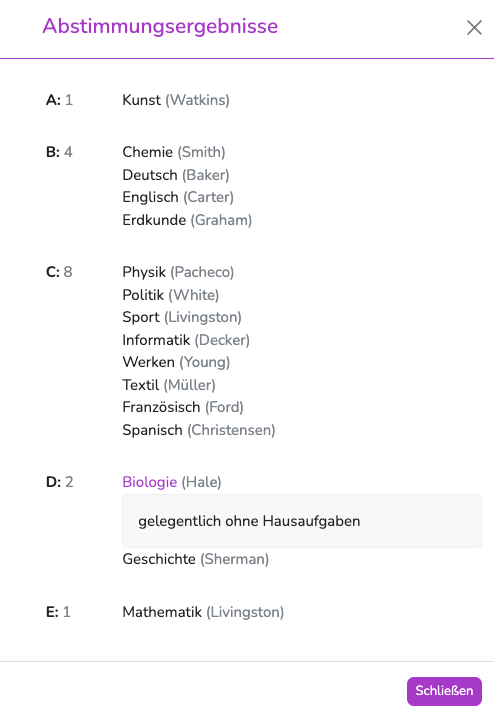

---
hide:
  - footer
---

{ .img-nav } { .arrow-nav } { .img-nav } 

 
<iframe width="560" height="315" src="https://www.youtube.com/embed/QtMXzSQqG70" title="YouTube video player" frameborder="0" allow="accelerometer; autoplay; clipboard-write; encrypted-media; gyroscope; picture-in-picture; web-share" allowfullscreen></iframe>

 

## 1. Klassenleitung 
{ .image }

Die Klassenleitung kann Vorschläge für die Bewertung machen. Dazu wird auf den Skalen die gewünschten Bewertung gewählt.    
Über dem Schieberegler befinden sich Zahlen, die Aufschluss über die Entscheidungen der Fachkollegen geben.  
Standardmäßig stimmen die Fachkollegen dem Vorschlag der Klassenleitungen zu. - Daher "nimmt" die Klassenlehrkraft gewissermaßen die Kollegen "mit", sobald sie den Schieberegler verschiebt.   
Abweichende Bewertungen werden ebenfalls angezeigt.  
Klickt man auf eine der Mengenangaben über den Skalen, kann man die Entscheidungen im Einzelnen einsehen.  
Falls eine Begründung hinterlegt wurde, kann sie hier gelesen werden.

{ .image-30 }

!!! success ""
    Die Eingabe auf der Skala wird automatisch gespeichert.  
    Begründungen werden erst gespeichert, wenn das Textfeld wieder inaktiv wird. (Mit der Maus daneben klicken.)

## 2. Fachlehrkräfte
{ .image }

Als Fachlehrkraft kannst du in der Einzelfachansicht im Eingabebereich unter "Zusätzliche Informationen" einsehen, welche Bewertung die Klassenleitung vorgeschlagen hat. - Erkennbar an der Position der Krone.  
Wenn du damit einverstanden bist, ist keine weitere Handlung nötig.  
Falls du eine eigene Bewertung vorschlagen möchtest, kannst du den Schieberegler entsprechend verschieben. - Bei Bedarf können auch Begründungen hinterlegt werden.  
Diese Begründungen erscheinen nicht auf dem Zeugnis, sondern dienen einzig als Information für die Klassenleitung.

!!! success ""
    Die Eingabe auf der Skala wird automatisch gespeichert.  
    Begründungen werden erst gespeichert, wenn das Textfeld wieder inaktiv wird. (Mit der Maus daneben klicken.)

## 3. Tipps

:fontawesome-solid-thumbs-up:{ .success-contrast } **Vor der Bewertungseingabe solltest du dich als Lehrkraft des Unterrichts markieren. (siehe Video)**{ .success-contrast } 
 
:fontawesome-solid-thumbs-up:{ .success-contrast } **Klassenlehrkräfte sollten die Eingaben für Ihre Klasse immer in der Klassenübersicht machen, Fachlehrkräfte immer in der Einzelfachansicht.**{ .success-contrast } 

<!-- ## Bemerkungen eintragen
Für die Bemerkungen in den Feldern **Berufsbildung**, **Arbeitsgemeinschaften** und **Sonstige Bemerkungen** kann der Aministrator Floskeln anlegen.  
Diese Floskeln werden eingeblendet, sobald in das entsprechende Textfeld geklickt wurde.  
Du kannst natürlich immer auch eigene Texte eintragen. 

### Komfort-Kommentar
Einige Merkmale von Schüler/innen werden automatisch aufgegriffen und in Form von **Quick-Floskeln** angeboten  
Dazu gehören zum Beispiel die **Versetzungsgefährdung**, zugeordnete **Dienste** oder hinterlegte **Förderbedarfe**. [:octicons-eye-16:](../../img/02_Schritt_für_Schritt/av_sv_comment_helper.png)  
Ein Klick auf "hinzufügen", schreibt die entsprechende Floskel in das Bemerkungsfeld.
 

## Bewertungen - Masseneingabe

!!! tip ""
    :exclamation: Die Texteintragungen werden automatisch gespeichert. -->

