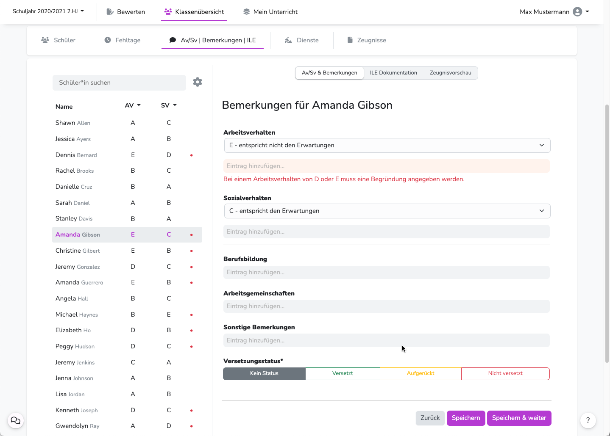

---
hide:
  - footer
---

 
{ .img-head }

 
## Bemerkungen eintragen
Für die Bemerkungen in den Feldern **Berufsbildung**, **Arbeitsgemeinschaften** und **Sonstige Bemerkungen** kann der Aministrator Floskeln anlegen.  
Diese Floskeln werden eingeblendet, sobald in das entsprechende Textfeld geklickt wurde.  
Du kannst natürlich immer auch eigene Texte eintragen. 

### Komfort-Kommentar
Einige Merkmale von Schüler/innen werden automatisch aufgegriffen und in Form von **Quick-Floskeln** angeboten  
Dazu gehören zum Beispiel die **Versetzungsgefährdung**, zugeordnete **Dienste** oder hinterlegte **Förderbedarfe**. [:octicons-eye-16:](../../img/02_Schritt_für_Schritt/av_sv_comment_helper.png)  
Ein Klick auf "hinzufügen", schreibt die entsprechende Floskel in das Bemerkungsfeld.
 

## Bemerkungen - Masseneingabe

!!! danger ""
    :exclamation: Die Texteintragungen werden nicht automatisch gespeichert.

