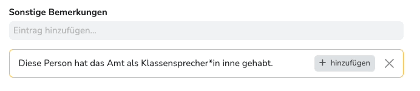
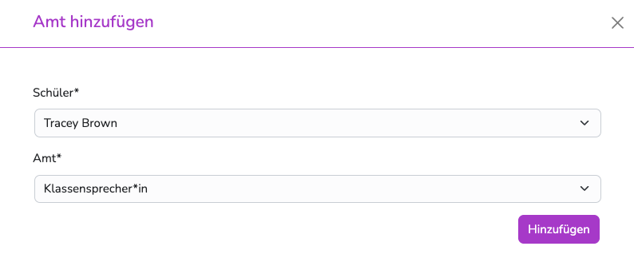

---
hide:
  - footer
---

{ .img-head }

!!! note ""
    **Warum muss ich das überhaupt machen?** 
    Üblicherweise bekommen Schüler*innen, die einen Klassendienst übernommen haben, auf ihrem Zeugnis eine entsprechende Bemerkung in das Feld "sonstige Bemerkungen".  
    Wenn Dienste zugewiesen werden, wird bei dem Kind an diesem Feld ein Bemerkungsvorschlag eingeblendet.
      
    { .image }
      

    Dieser Vorschlag wird zentral vom Administrator angelegt und gilt einheitlich schulweit für den entsprechenden Dienst.  
    Natürlich kann jede Lehrkraft eigene Vorschläge eintragen. In diesem Fall ist das Zuweisen der Dienste nicht nötig. 
 

## Dienste zuweisen

1. Wechsle dazu in "Mein Unterricht"  
2. Klicke nun in dem Menü auf "Dienste" 

Hier können nun über "Hinzufügen" weitere Dienste zugewiesen werden.  
{ .image }

Um Zuweisungen zu löschen, einfach auf den Papierkorb in der entsprechenden Zeile klicken.  
(Vor dem Löschen erfolgt eine Bestätigungsabfrage)

!!! warning ""
    **Was kann schiefgehen?**  
    Dienste können erst zugewiesen werden, wenn sie im Administrationsbereich angelegt wurden.  
    Falls das Anlegen der Dienste nicht möglich ist, kontaktiere den Administrator.