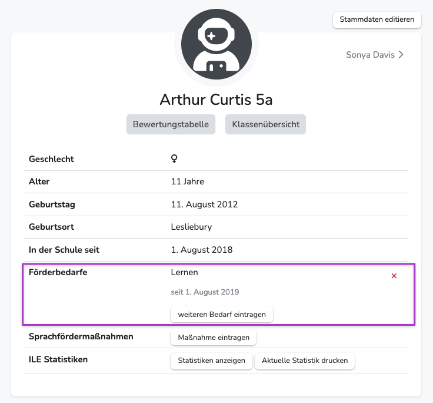

---
hide:
  - footer
---

!!! bread ""
    Schülereinzelansicht > Förderbedarfe
    
{ .img-head }

 

## Förderbedarf anlegen

**Zur Schülereinzelansicht:** Klick auf drei Punkte vor Schülernamen ODER die Schülersuche im oberen Hauptmenü

1. Navigiere zur Schülereinzelansicht des entsprechenden Kindes
2. Klicke bei **Förderbedarfe** auf "weiteren Bedarf anlegen"
3. Hinterlege Art und Start-/Verfügungsdatum des Förderbedarfes (Enddatum ist optional)
4. Durch "Speichern" wird der Bedarf angelegt.

**Der angelegte Förderbedarf bleibt dem Kind zugewiesen, bis das Enddatum eintritt oder der Bedarf gelöscht wird.**
Es können beliebig viele Bedarfe angelegt werden, falls ein Kind mehrere hat.

 

## Und die Floskel für das Bemerkungsfeld?
Es erscheint nun bei dem entsprechenden Kind in **Klassenübersicht > Av/Sv | Bemerkungen** an dem Feld für "Sonstige Bemerkungen" ein Hinweis.
Falls der Admin deiner Schule Floskeln für die Förderbedarfe hinterlegt hat, kannst du diese nun mit einem Klick hinzufügen.

{ .image }
