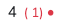

---
hide:
  - footer
---

!!! danger ""
    Achte darauf, dass immer das [korrekte Schuljahr](../../img/09_Misc/Schuljahr_auswahl.png) ausgewählt ist.
 
Es gibt mehrere Möglichkeiten Noten einzugeben:

    <figure>
        <figcaption class="img-caption">Bewertungsübersicht</figcaption>
        
    </figure>
    <figure>
        <figcaption class="img-caption">Einzelfachansicht</figcaption>
        
    </figure>
    <figure>
        <figcaption class="img-caption">Schüleransicht</figcaption>
        
    </figure>

 

## 1. Bewertungsübersicht
{ .img-norm } 

Die Bewertungsübersicht öffnet sich direkt nach dem Login und bietet dir die umfangreichsten Möglichkeiten bei der Noteneingabe.
Hier werden standardmäßig die Noten eingetragen.
---
### 1.1 Noten eingeben

1. Wähle die richtige Klasse [:octicons-eye-16:](../../img/09_Misc/auswahl_klasse.gif) aus.

2. Klicke auf eine Note, um sie zu verändern.
3. Drücke ++tab++ , um zur nächsten Note in deinem Fach zu springen.
4. Drücke ++enter++ , um die Eingabe abzuschließen.

!!! note ""
    Die Notentabelle speichert deine Eingaben automatisch.
---
### 1.2 Was bedeuten die Notenanhänge?

{ .img-norm }

1. Links: Die normale Note des Halbjahres. Wenn sie mangelhaft oder schlechter ist, wird sie rot dargestellt.

2. Mitte: Die Note des ersten Halbjahres. *Wird nur im zweiten Halbjahr angezeigt.* Notensprünge werden immer eingeblendet. Normale Vornoten können dazugeschaltet werden.
    - rot = Verschlechterung 
    - grün = Verbesserung 
    - grau = ohne Besonderheiten

3. Rechts: Fehlt die Begründung für den Notensprung, wird der Punkt angezeigt. Ein Klick darauf ermöglicht die Eingabe der Begründung.
    
!!! note ""
    Ein Klick auf die Vornote zeigt die Notensprungbegründung.
---
### 1.3 Masseneingabe

Am Ende jeder Spalte in der Tabelle findest du ein :fontawesome-solid-gear: . 
Damit kannst du schnell Eingaben für alle Schüler/innen vornehmen.  
*(Zum Beispiel "n.b.- nicht bewertbar oder n.e.-nicht erteilt" für alle Schüler/innen)*
---
### 1.4 Noten vorlesen lassen

Wenn du dir die Noten vorlesen lässt, kannst du leichter deine Eingaben kontrollieren.
(Klicke dazu auf das :fontawesome-solid-gear: am Ende der Notenspalte deines Faches.)

<!-- !!! intralink ""
    Mehr Informationen zur Bewertungstabelle findest du bei den [**Arbeitsbereichen**](../Arbeitsbereiche/Bewertungsuebersicht.md) -->
 

## 2. Einzelfachansicht

{ .img-norm } 

Zu der Einzelfachansicht gelangst du, indem du auf den Fächernamen in der Bewertungstabelle klickst. [:octicons-eye-16:](../../img/09_Misc/zur_einzelfachansicht.gif)

---
### 2.1 Noten eintragen

1. Wähle den/die Schüler/in aus
2. Trage die Note [ins Notenfeld](../../img/02_Schritt_für_Schritt/notenfeld.png) ein.
3. Drücke ++tab++ , um zum nächsten Schüler zu springen. (Oder "Speichern & weiter")
4. Beende die Eingabe mit { .img-inline }

### 2.2 Begründungen für Notensprünge

Falls ein Notensprung vorliegt, muss eine Begründung eingegeben werden. Du erkennst die Schüler/innen mit Notensprung an dem roten Punkt hinter dem Namen.
Sobald eine Notenbegründung eingegeben wurde, wird der Punkt grün. 
Achtung: Diplomify überprüft nicht die Qualität der Eingaben. Sobald eine beliebige Zeichenfolge eingetragen und gespeichert wurde, schaltet der Indikator auf grün.

<!-- !!! intralink ""
    Mehr Informationen zur Einzelfachansicht findest du bei den [**Arbeitsbereichen**](../Arbeitsbereiche/Bewertungsuebersicht.md) -->
 

## 3. Schüleransicht

{ .img-norm } 

Zur Schüleransicht gelangst du durch einen Klick auf den Schülernamen in der Notentabelle.

!!! note ""
    Die Schüleransicht dient dem Gesamtüberblick über einen/eine Schüler/in.
    Man kann hier Noten eingeben.
    Für die beste Benutzererfahrung empfehlen wir aber die Notenübersicht oder die Einzelfachansicht.

### 3.1 Noten eintragen
Das aktuelle schuljahr wird dirket unter den Stammdaten des/der Schüler/in angezeigt.

1. Klicke die gewünschte Note an und trage deine Note ein.
2. Beende die Eingabe mit ++enter++

<!-- !!! intralink ""
    Mehr Informationen zur Schüleransicht findest du bei den [**Arbeitsbereichen**](../Arbeitsbereiche/Schüler*innen Stammdaten.md) -->

