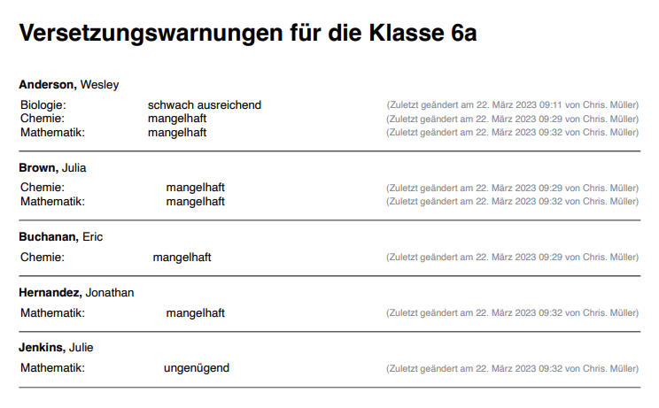

---
hide:
  - footer
---
!!! note ""
    Versetzungswarnungen können nur im 2. Halbjahr vergeben werden. Im ersten Halbjahr werden die entsprechenden Buttons nicht angezeigt. 

<iframe width="560" height="315" src="https://www.youtube.com/embed/5cevTrU3NzY" title="YouTube video player" frameborder="0" allow="accelerometer; autoplay; clipboard-write; encrypted-media; gyroscope; picture-in-picture; web-share" allowfullscreen></iframe>

 
## 1. Für Fachlehrkräfte: Versetzungswarnungen vergeben

Navigiere dazu in die Einzelfachansicht. (In der Bewertungstabelle auf das gewünschte Fach klicken oder in "Mein Unterricht" bei dem gewünschten Fach auf "bewerten" klicken.)

Scrolle zum Bereich "Zusätzliche Informationen"

Vergib die gewünschte Warnung. - Ein erneuter Klick auf die gewählte Warnung entfernt sie wieder.
Der Text unter der Warnung weist auf die letzte Änderung hin. 

:fontawesome-solid-thumbs-up:{ .success-contrast } **Die Eingabe wird automatisch gespeichert.**{ .success-contrast } 

{ .image }

!!! warning ""
    Die Notenwarnung ist unabhängig von der tatsächlichen Note. Es kann daher theoretisch auch eine Notenwarnung erfolgen, wenn die Zeugnisnote beispielsweise "befriedigend" ist.

 
## 2. Für Klassenleitungen: Ansicht und Druck der Warnungen
 Navigiere dazu in die Klassenübersicht.

!!! warning ""
    Hier werden nur jene Warnungen angezeigt, die von den Lehrkräften in den einzelnen Fächern vergeben wurden. Warnungen, die etwa im Halbjahreszeugnis ausgesprochen wurden, werden hier nicht angezeigt.

{ .image }

Die vorhandene Übersicht kann durch Betätigung des Buttons "Übersicht drucken" zur Weiterverarbeitung und zur Erstellung der Blauen Briefe gedruckt werden.

{ .image-75 }

 
## 3. für Admins: Druck der Warnungen - schulweit

[Erfahre mehr darüber in den Adminstrations-Artikeln ...](../../Anleitungen/Administration/Versetzungswarnungen_schulweit_drucken.md)