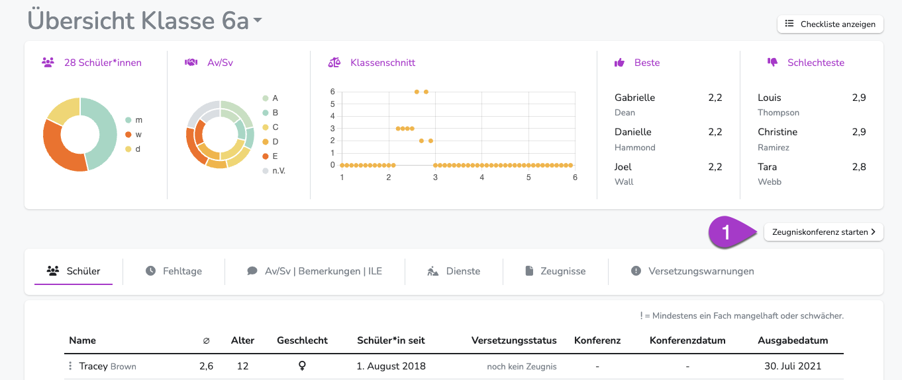
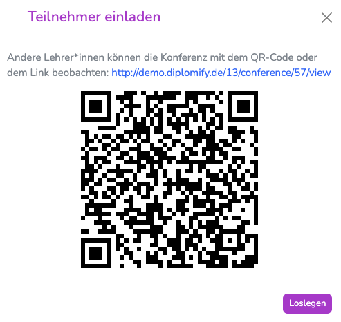
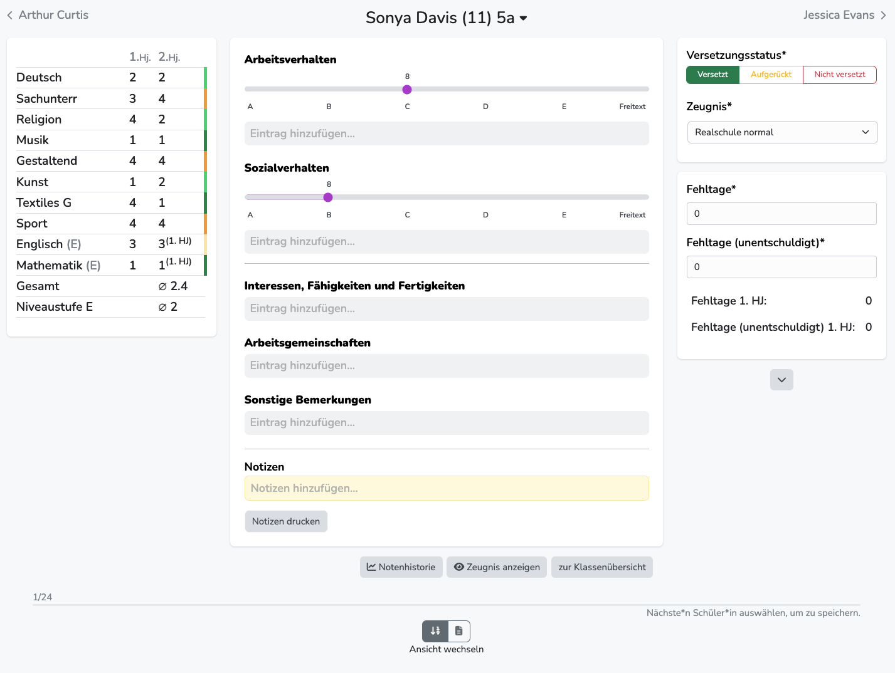
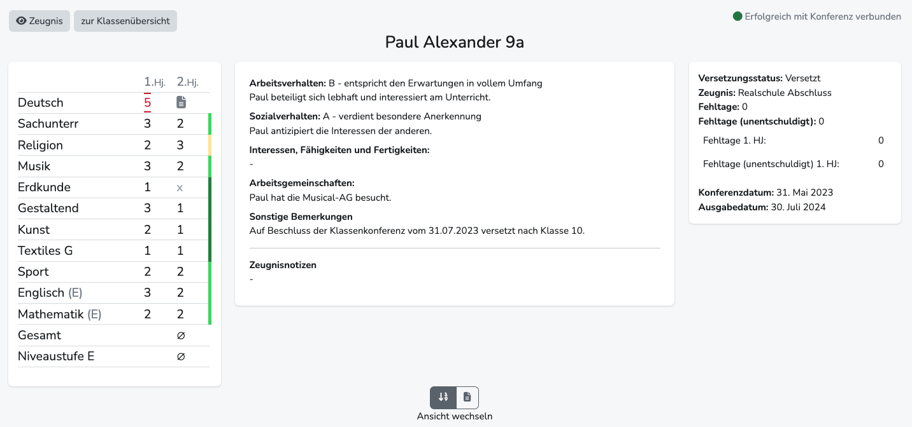

---
hide:
  - footer
---

!!! bread ""
    Klassenübersicht > Zeugniskonferenz starten/fortsetzen

<!-- { .img-head } -->

Zeugniskonferenzen können nur von Lehrkräften gestartet werden, die über Klassenadminrechte verfügen.  
Lehrkräfte ohne diese Rechte können aber im Zuschauermodus einer bereits gestarteten Konferenz beiwohnen.

Um die Konferenz zu starten, klicke auf "Zeugniskonferenz starten/fortsetzen" in der Klassenübersicht: 

{ .image }

## 1. Konferenzstart
1. Nachdem die Konferenz in der Klassenübersicht das erste Mal aktiviert wurde, wird der Wartescreen angezeigt. Die Konferenz ist noch nicht offiziell gestartet. Es wird daher noch nicht das Konferenzdatum festgelegt und das Einloggen im Zuschauermodus ist auch noch nicht möglich.

2. Erst im nächsten Schritt wird die Konferenz gestartet.

3. Der QR-Code kann genutzt werden, um als Zuschauer/in beizutreten. (Teilnehmer müssen bei Diplomify eingeloggt sein.) Zusätzlich können Fachlehrkräfte in die Klassenübersicht der Klasse navigieren und auf den Button "Aktive Zeugniskonferenz ansehen" klicken, um im Zuschauermodus teilzunehmen.

{ .image-30 }

 
 

## 2. Konferenzansicht 
{ .image }

Grundsätzlich sind hier alle Eintragungen des aktuellen Halbjahres änderbar.  
Eine Speicherung erfolgt abschließend, sobald zum nächsten oder vorherigen Schüler gewechselt wird. 
Die Änderungen können nur von Personen mit Klassenadminrechten vorgenommen werden. Der Zuschauermodus wird nach einigen Sekunden automatisch aktualisiert.
Wir empfehlen den Browser für die Dauer der Konferenz in den Vollbild-Modus zu schalten (in der Regel die ++f11++ - Taste).  

 
 

## 3. Zuschauermodus 
{ .image }

Im Zuschauermodus sind keine Änderungen möglich.  
Die Teilnahme an der Konferenz ist nur für registrierte Nutzer/innen möglich und erfordert einen Login.
Die Anzeige wird nach Änderungen (Korrekturen, Wechsel des angezeigten Schülers) automatisch aktualisiert.
Er wird automatisch beendet, wenn die gestartete Konferenz durch die Konferenzleitung verlassen wird.
Wir empfehlen die Teilnahme per Tablet oder Laptop.