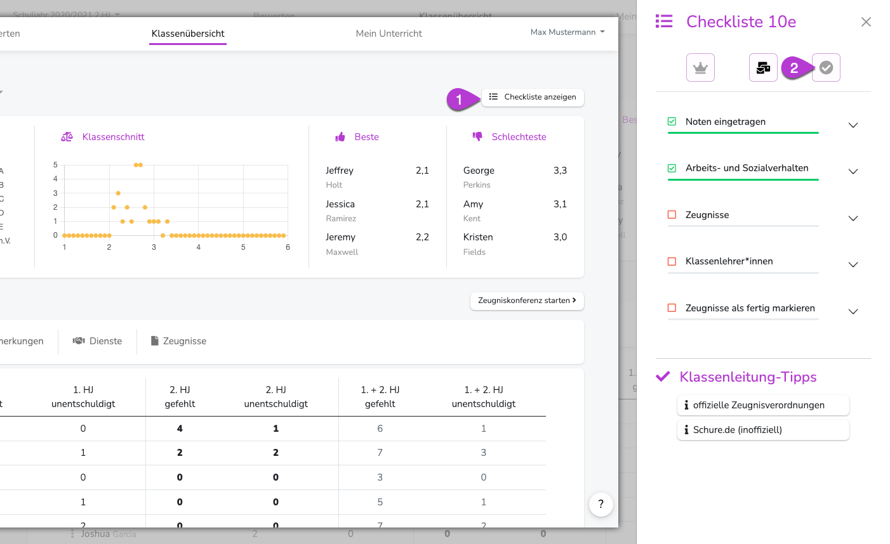

---
hide:
  - footer
---

{ .img-head }
  
!!! note ""
    **Warum muss ich das überhaupt machen?** 
    Möglicherweise übernimmt der Admin deiner Schule den Zeugnisdruck. Dann interessiert ihn natürlich, ob deine Zeugnisse druckbereit sind. 
 
**Wechsle dazu in die Klassenübersicht**

2. Öffne die Checkliste
3. Aktiviere den Haken in der Checkliste oben rechts.

Diese Klasse wird nun im Adminbereich als "druckbereit" angezeigt. 
Um den Status zu ändern, klicke erneut auf den Haken.
