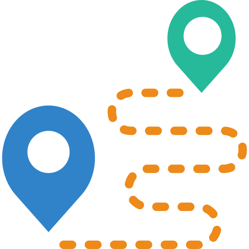

---
hide:
  - navigation
  - footer
  - toc
---

<<<<<<< HEAD
# Hi. Wie können wir helfen?
=======
# Hi. Wie können wir dir helfen?
>>>>>>> origin/main
 
 

<h4>Unsere Empfehlungen</h4>

  <a href="./img/quick_start/bewertungsuebersicht.png" target="_blank">
      <figure>
          <figcaption class="img-caption">Bewertungsübersicht</figcaption>
          
      </figure>
  </a>

  <a href="./img/quick_start/klassenuebersicht.png" target="_blank">
      <figure>
          <figcaption class="img-caption">Klassenübersicht</figcaption>
          
      </figure>
  </a>

  <a href="./img/quick_start/mein_unterricht.png" target="_blank">
      <figure>
          <figcaption class="img-caption">Mein Unterricht</figcaption>
          
      </figure>
  </a>

 
---
 

<h4>Alle Anleitungen</h4>

!!! box ""
    
    ### Schritt für Schritt Anleitungen

    Einfache Erklärungen typischer Aufgaben - Schritt für Schritt.

    [weiterlesen...](Anleitungen/Schritt_für_Schritt/Arbeits-_&_Sozialverhalten.md)

<<<<<<< HEAD
<!-- !!! box ""
    
=======
!!! box ""
    
>>>>>>> origin/main
    ### Arbeitsbereiche

    Lerne hier die einzelnen Arbeitsbereiche in Diplomify kennen - und was du dort alles machen kannst.

    [weiterlesen...](Anleitungen/Arbeitsbereiche/Bewertungsuebersicht.md) -->

<<<<<<< HEAD
<!-- !!! box ""
    
=======
!!! box ""
    
>>>>>>> origin/main
    ### Komfortfunktionen

    Diplomify unterstützt dich bei der Arbeit. Lerne hier, wie genau.

    [weiterlesen...](quick_start.md)
---
!!! box_alert ""
    
    ### Administration

    Diplomify unterstützt dich bei der Arbeit. Lerne hier, wie genau.

    [weiterlesen...](Anleitungen/Administration/Übersicht.md) -->