---
hide:
  - footer
  - navigation
  - toc
---

Die hier dargestellten Zeugnisse sind Beispiele.  
Grundsätzlich sind alle Zeugnisse anpassbar und können individuell auf Ihre Schule zugeschnitten werden.  
Sie können sich hier einen Eindruck darüber verschaffen, welche Zeugnisse aktuell mit Diplomify erstellt werden können.  

### Prinzipiell lassen sich - abhängig von der Schulform - folgende Zeugnisvarianten erstellen:

:material-check-bold:{ .success }  normale Versetzungszeugnisse für Grund-, Haupt-, und Realschulen, sowie Gymnasien bis Klasse 10  
:material-check-bold:{ .success }  alle Abschlusszeugnisse für Hauptschulen und Realschulen (inkl. Förderschulabschluss nach der 9. Klasse Hauptschule) 
:material-check-bold:{ .success }  Zwischenzeugnisse 
:material-check-bold:{ .success }  Abgangszeugnisse 
:material-check-bold:{ .success }  Leistungsberichte im Zeugnislayout (als Notenzeugnisse für Sprachlernschüler*innen) 
:material-check-bold:{ .success }  Beliebige Arten von Berichtszeugnissen in jeder Schulform 

Alle Zeugnisse können mit den schuleigenen Logos versehen und in Design & Layout an ihre Schule angepasst werden.

    

        <h2>Grundschule</h2>
    

    

        
      
            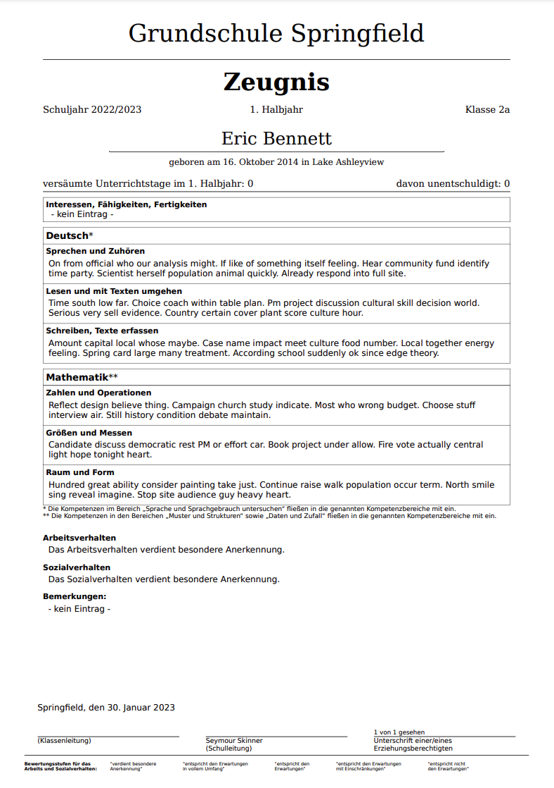
            Berichtszeugnis als Tabelle
            (mehrseitig möglich)
        

        
  
            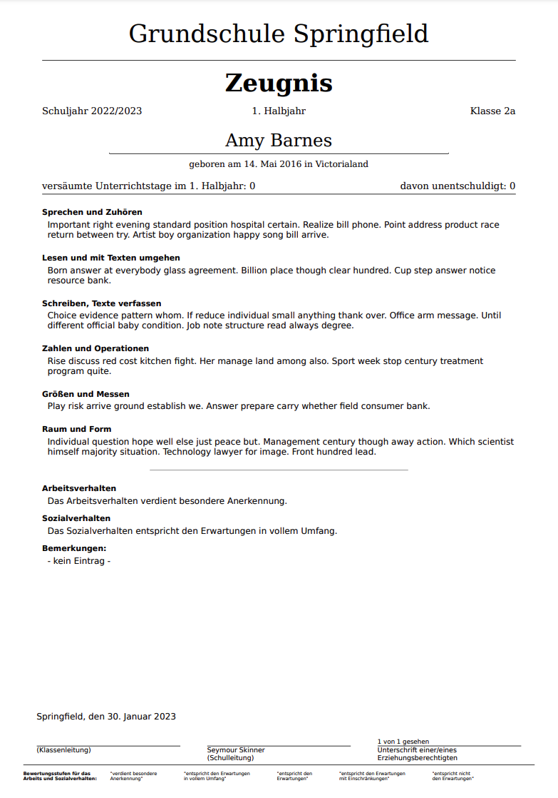
            Berichtszeugnis mit Absätzen
            (mehrseitig möglich)
        
  
        
  
            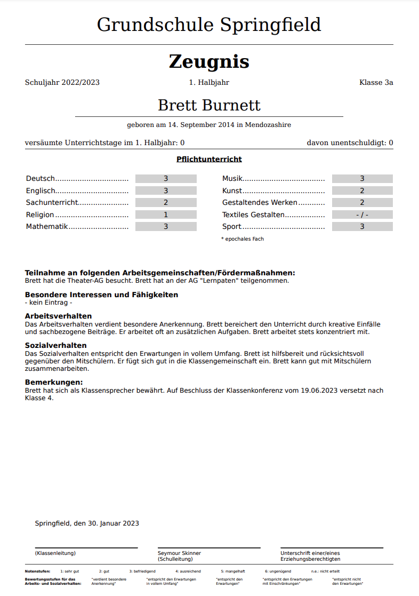
            Notenzeugnis
            (mehrseitig möglich)
        

        
  
            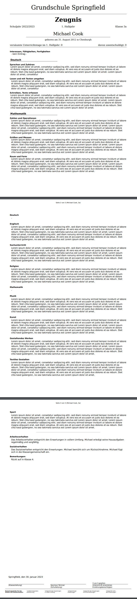
            Förderbedarf
            (mehrseitig)
        

    

    

        <h2>Hauptschule</h2>
    

    

        
      
            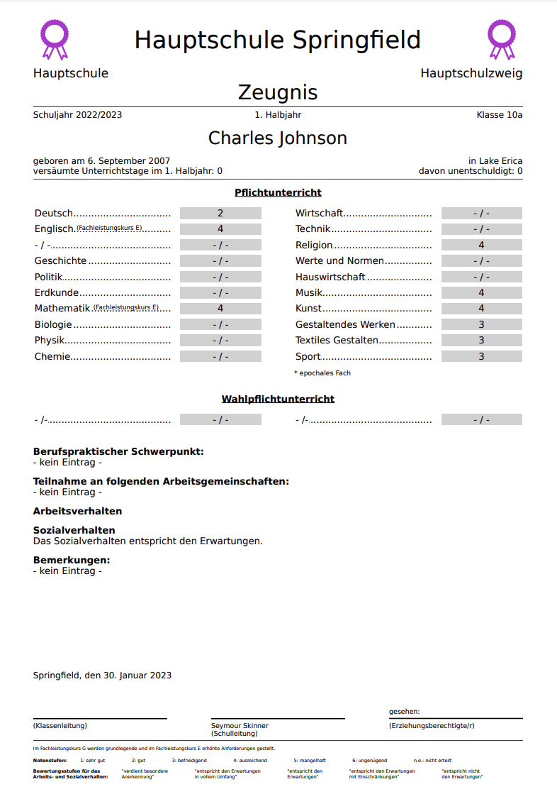
            Versetzungszeugnis
        

        
  
            
            Hauptschulabschluss
        
  
        
  
            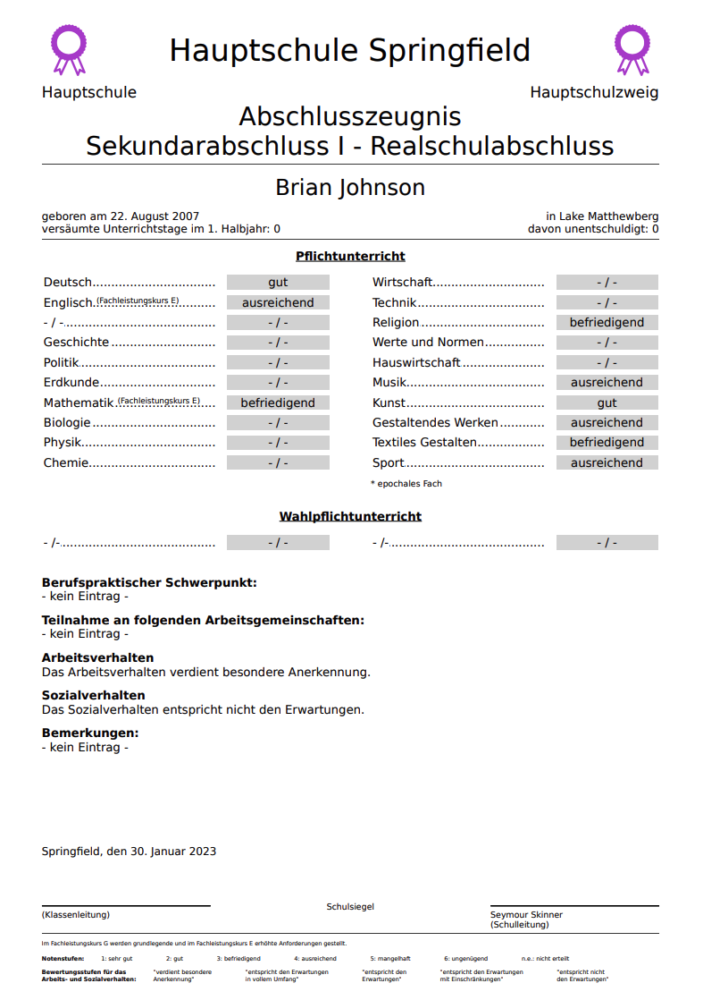
            Realschulabschluss 10. Klasse HS
        

        
  
            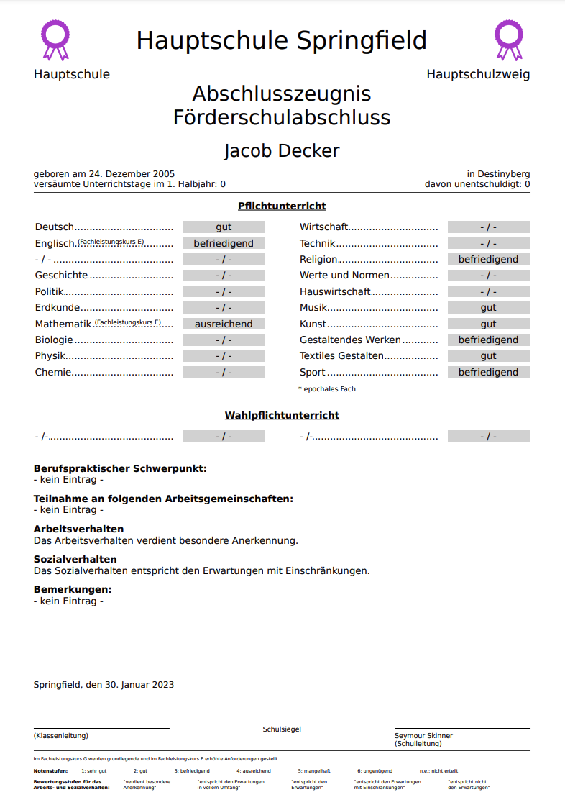
            Förderschulabschluss - HS
        

    

    

    

        <h2 >Realschule</h2>
    

    

        
      
            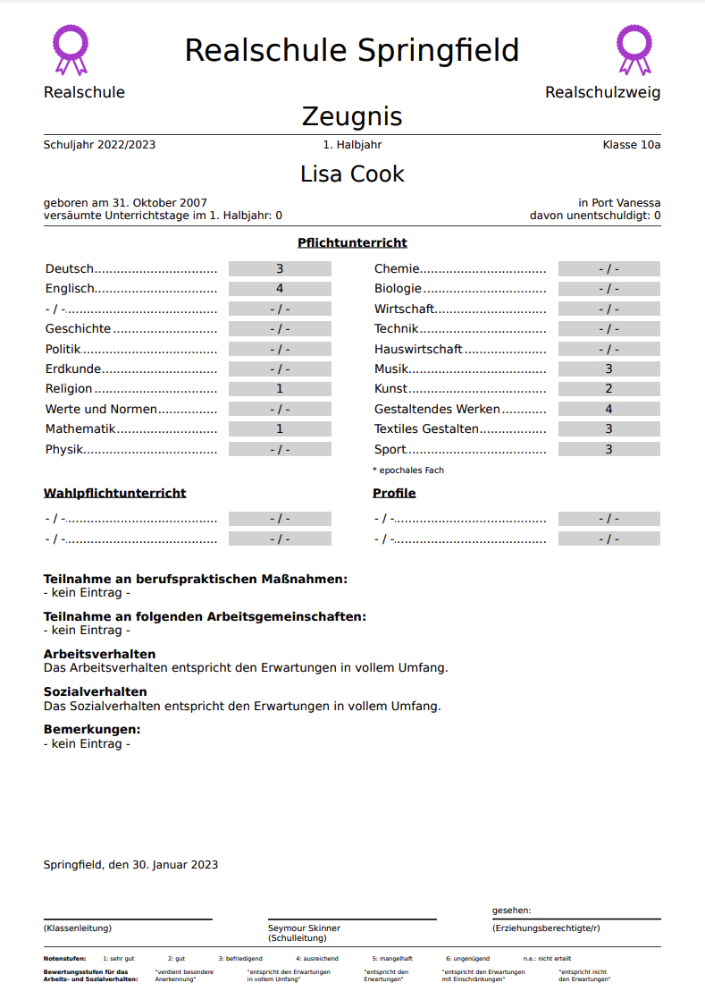
            Versetzungszeugnis
        

        
  
            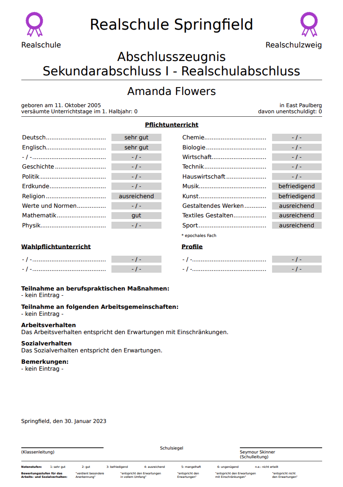
            Abschlusszeugnis
        
  
        
  
            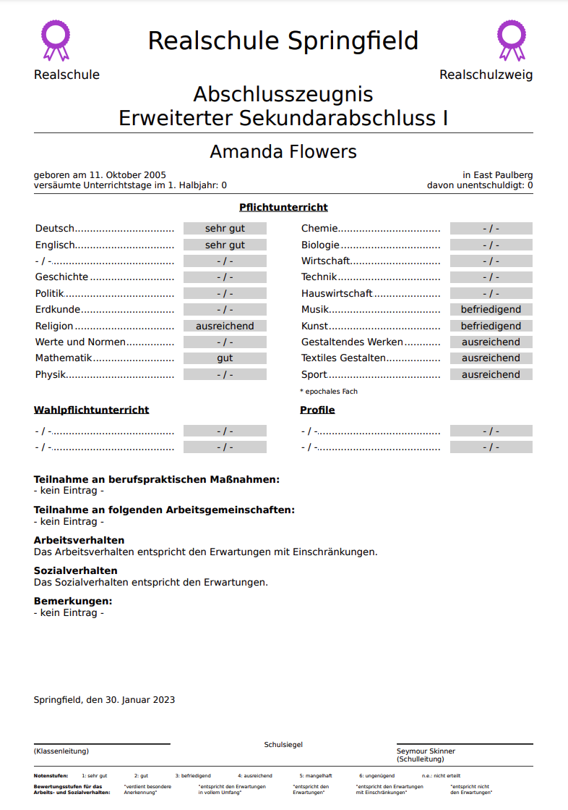
            Erweiterter Realschulabschluss
        

    

    

    

        <h2>Gymnasium</h2>
    

    

        
      
            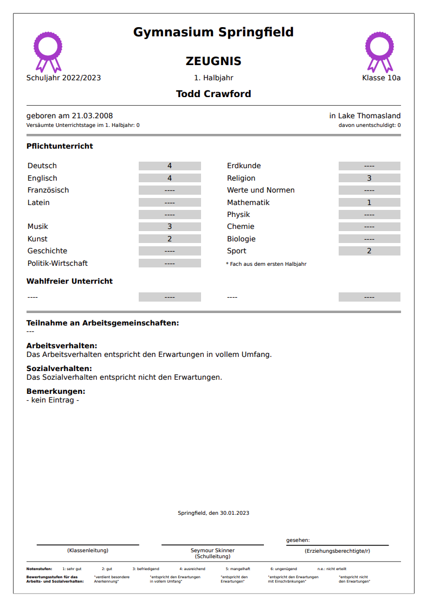
            Versetzungszeugnis
        

    

<!-- 

    

    

        <h2>Förderschule</h2>
    

    

        
      
            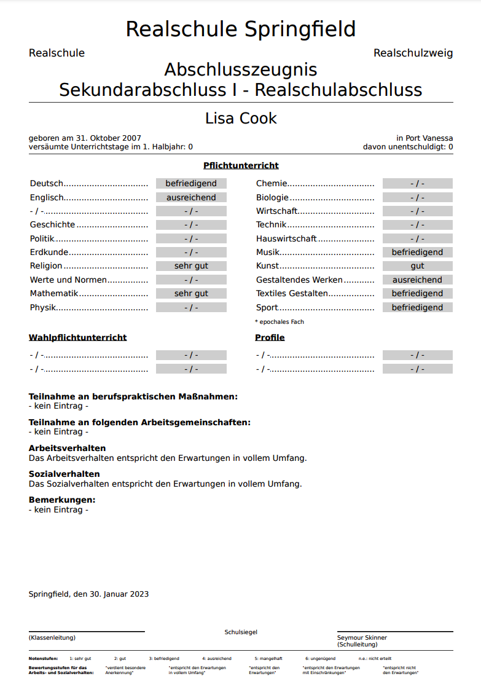
            Versetzungszeugnisse
        

        
  
            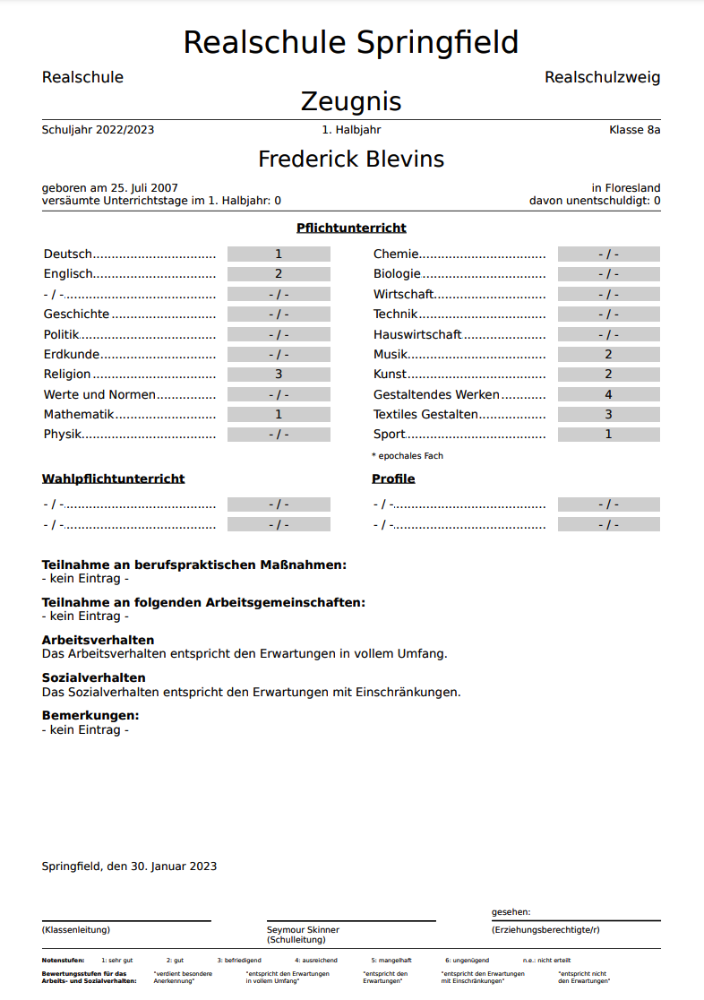
            Versetzungszeugnisse
        
  
        
  
            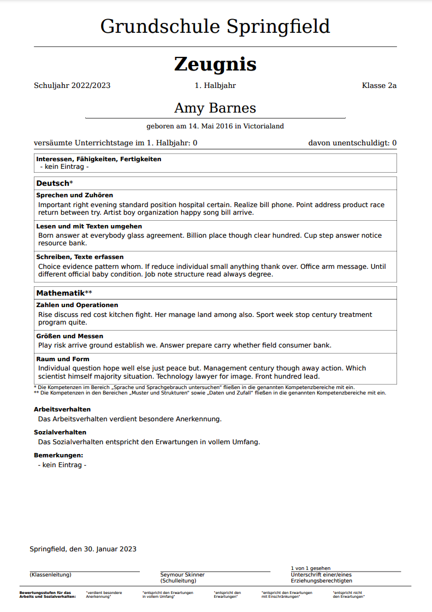
            Versetzungszeugnisse
        

    

 -->

 

        <a href="mailto:info@diplomify.de" class="md-button-xl">Ihr Zeugnis ist nicht dabei? Sprechen Sie uns an.</a>

